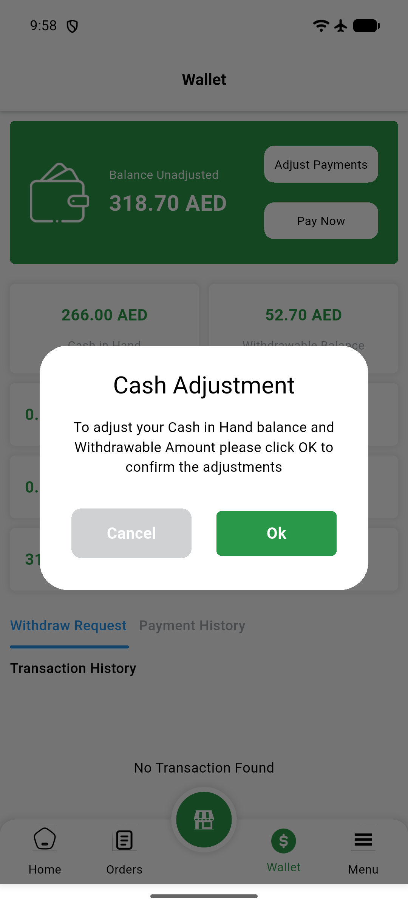
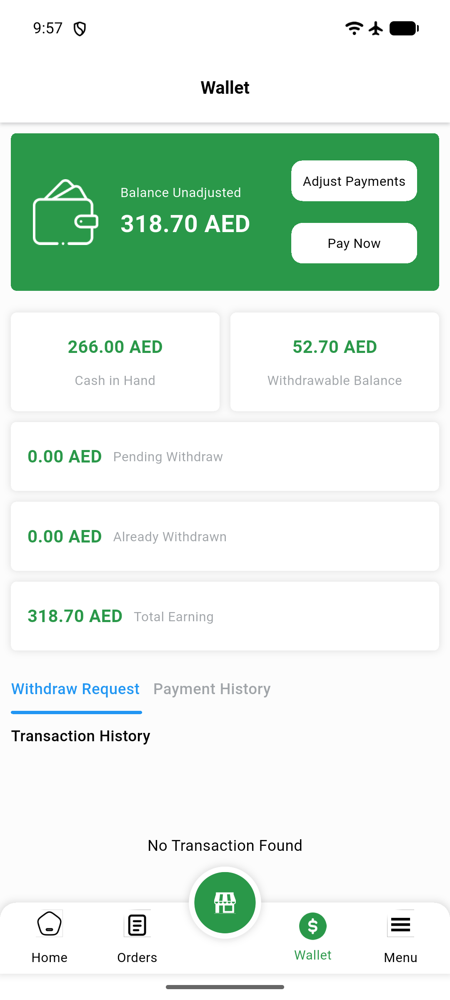
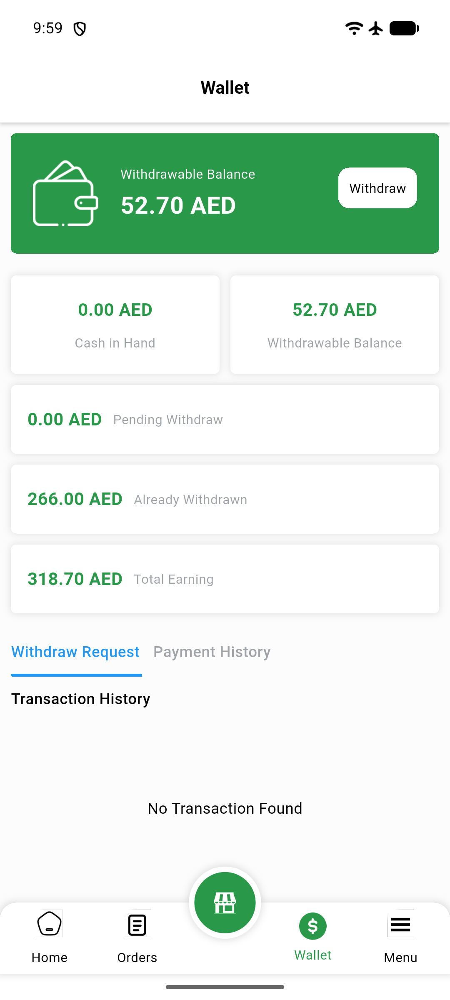

# QA Evidence — NEARS-1886

**PASS — VendorApp wallet-adjustment re-entry guard: 3/3 AC demonstrated live (emulator-5564, isolated DB copy multi_food_db_qa1886)**

**3 screenshot(s).** Click any thumbnail for full resolution.

<table>
<tr>
<td align="center" width="33%"> ac1 reopened ok not stuck</td>
<td align="center" width="33%"> ac1 spinner inflight</td>
<td align="center" width="33%"> ac2 ac3 post adjustment state</td>
</tr>
</table>

---
*From `nears/docs/qa-evidence/NEARS-1886/` · public-repo scrub policy (no live secrets; verified clean).*
