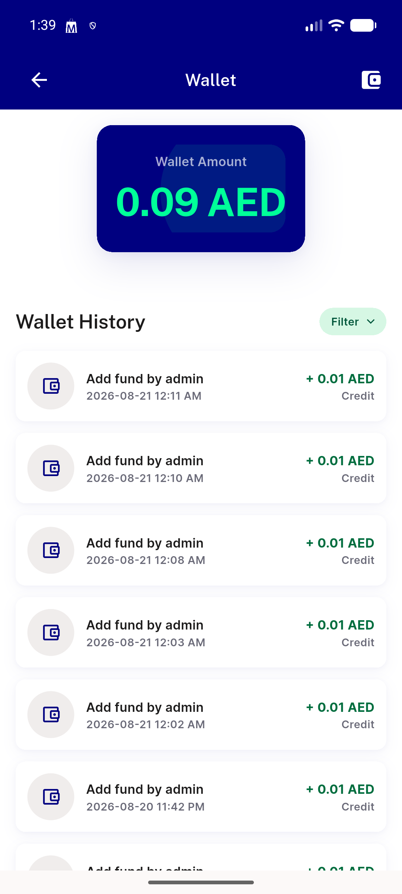

# QA Evidence — NEARS-1891

**PASS — NEARS-1891 add-fund dialog Get.back() guard: test-level (config-gated env), 90/90 wallet suite green, live wallet-screen regression clean**

**1 screenshot(s).** Click any thumbnail for full resolution.

<table>
<tr>
<td align="center" width="33%"> wallet screen live regression</td>
</tr>
</table>

---
*From `nears/docs/qa-evidence/NEARS-1891/` · public-repo scrub policy (no live secrets; verified clean).*
