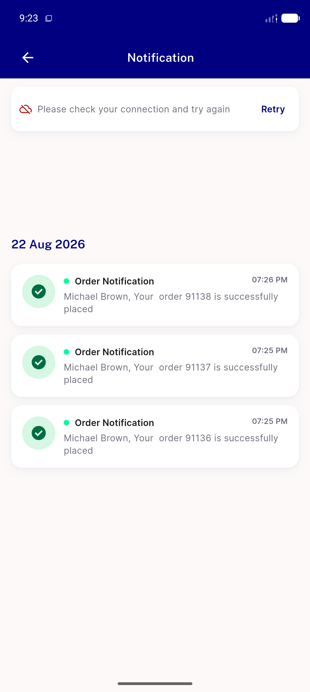
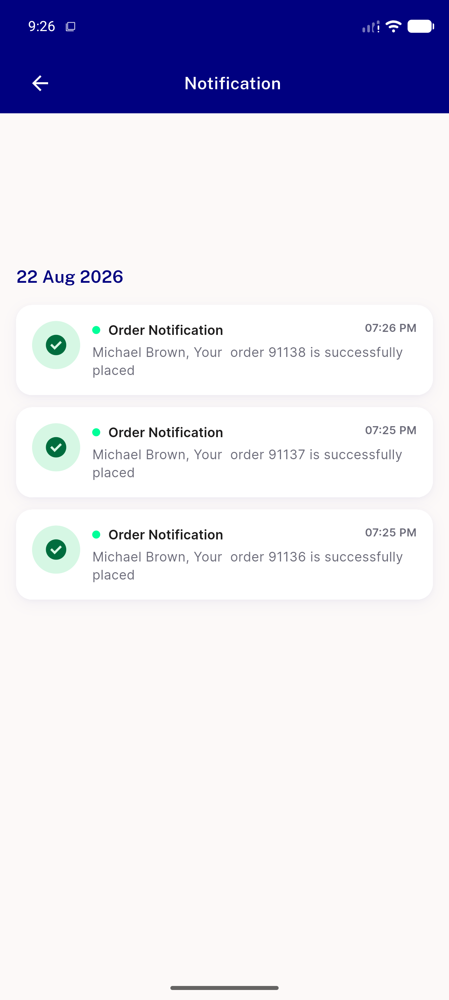
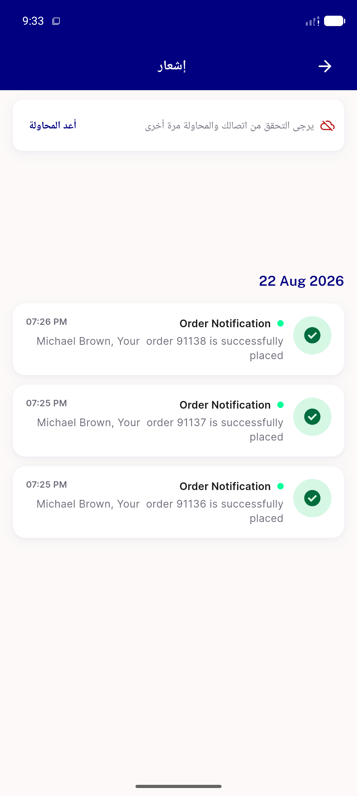

# QA Evidence — NEARS-1893

**PASS — notification screen inline error row over stale data (NEARS-1893), mirrors NEARS-1777 Coupon precedent**

**3 screenshot(s).** Click any thumbnail for full resolution.

<table>
<tr>
<td align="center" width="33%"> ac1 ac3 inline row offline</td>
<td align="center" width="33%"> ac2 retry recovered</td>
<td align="center" width="33%"> ac6 rtl arabic inline row</td>
</tr>
</table>

---
*From `nears/docs/qa-evidence/NEARS-1893/` · public-repo scrub policy (no live secrets; verified clean).*
