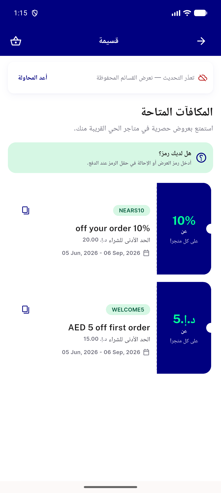
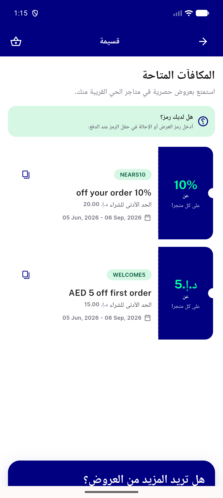

# QA Evidence — NEARS-1894

**PASS — evidence + regression log addendum**

**3 screenshot(s).** Click any thumbnail for full resolution.

<table>
<tr>
<td align="center" width="33%"> ac1 retry row 8s timeout</td>
<td align="center" width="33%"> ac2 notifications still pending 25s</td>
<td align="center" width="33%"> ac3 coupon happy path</td>
</tr>
</table>

### Other artifacts
- [`bug-norderstatuscard-overflow.log`](bug-norderstatuscard-overflow.log)

---
*From `nears/docs/qa-evidence/NEARS-1894/` · public-repo scrub policy (no live secrets; verified clean).*
