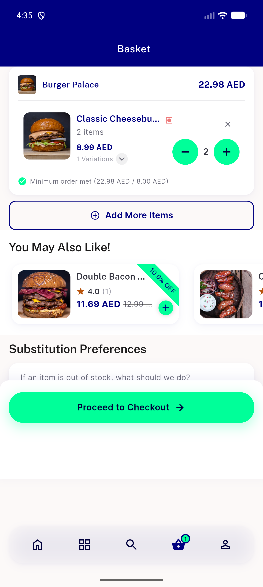
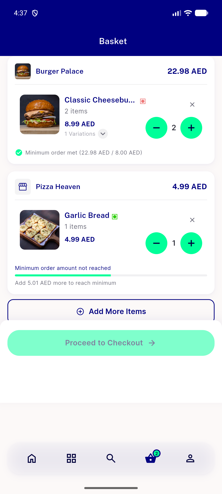

# QA Evidence — NEARS-1895

**PASS — cart min-order-met row now labelled 'Minimum order met (subtotal / minimum)' EN+AR, no regressions**

**4 screenshot(s).** Click any thumbnail for full resolution.

<table>
<tr>
<td align="center" width="33%"> ac1 ac2 min order met en</td>
<td align="center" width="33%"> ac3 min order met ar rtl</td>
<td align="center" width="33%"> ac3 narrow 320dp ar no overflow</td>
</tr>
<tr>
<td align="center" width="33%"> regression multistore met notmet en</td>
</tr>
</table>

### Other artifacts
- [`bug-cart-item-widget-variations-row-overflow-narrow-ar.log`](bug-cart-item-widget-variations-row-overflow-narrow-ar.log)
- [`progress.md`](progress.md)

---
*From `nears/docs/qa-evidence/NEARS-1895/` · public-repo scrub policy (no live secrets; verified clean).*
