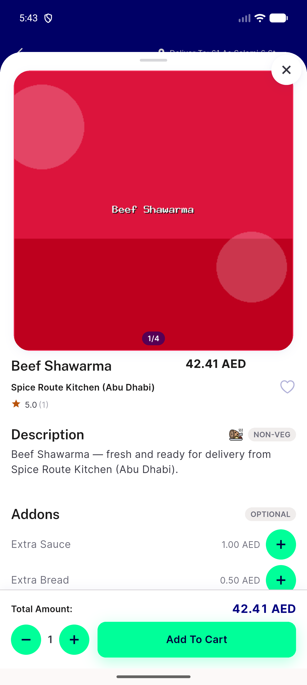
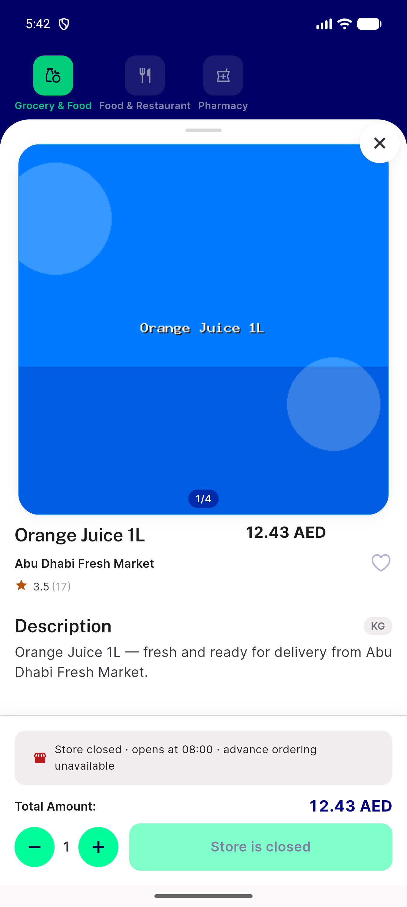
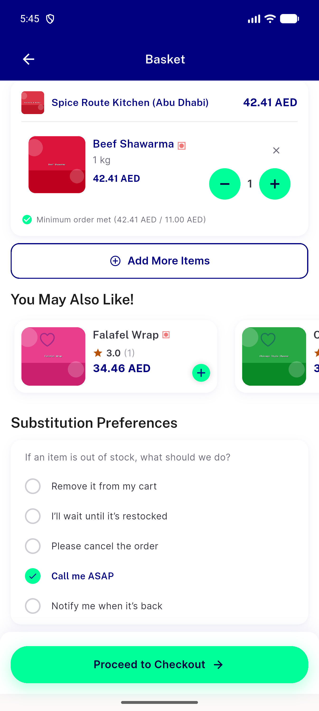

# QA Evidence — NEARS-1896

**PASS -- force-unwrap guards verified on device (emulator-5556) + 23/23 automated backstop green**

**3 screenshot(s).** Click any thumbnail for full resolution.

<table>
<tr>
<td align="center" width="33%"> ac2 populated item addons beef shawarma</td>
<td align="center" width="33%"> ac2 populated item orange juice</td>
<td align="center" width="33%"> regression cart with addon item</td>
</tr>
</table>

---
*From `nears/docs/qa-evidence/NEARS-1896/` · public-repo scrub policy (no live secrets; verified clean).*
