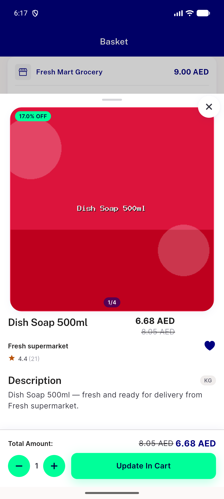

# QA Evidence — NEARS-1897

**PASS — item bottom sheet dead-param removal, UserApp**

**2 screenshot(s).** Click any thumbnail for full resolution.

<table>
<tr>
<td align="center" width="33%"> ac2 item sheet cart edit</td>
<td align="center" width="33%"> ac2 item sheet store listing</td>
</tr>
</table>

---
*From `nears/docs/qa-evidence/NEARS-1897/` · public-repo scrub policy (no live secrets; verified clean).*
