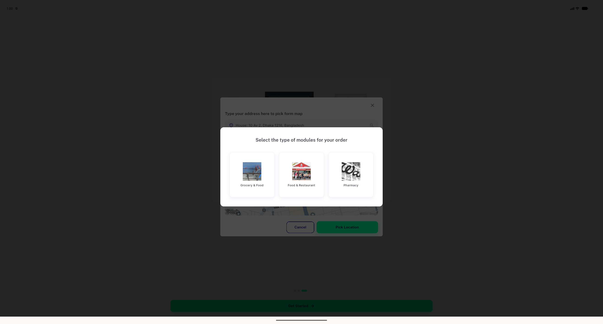

# QA Evidence — NEARS-1903

**PASS — all 4 ACs demonstrated live on emulator-5554, light mode, automated backstop green (item_sheet_barrier_dim_test.dart 6/6, item+location suites 397/397, nears_dls 1515/1515)**

**1 screenshot(s).** Click any thumbnail for full resolution.

<table>
<tr>
<td align="center" width="33%"> module picker scrim heavy</td>
</tr>
</table>

---
*From `nears/docs/qa-evidence/NEARS-1903/` · public-repo scrub policy (no live secrets; verified clean).*
