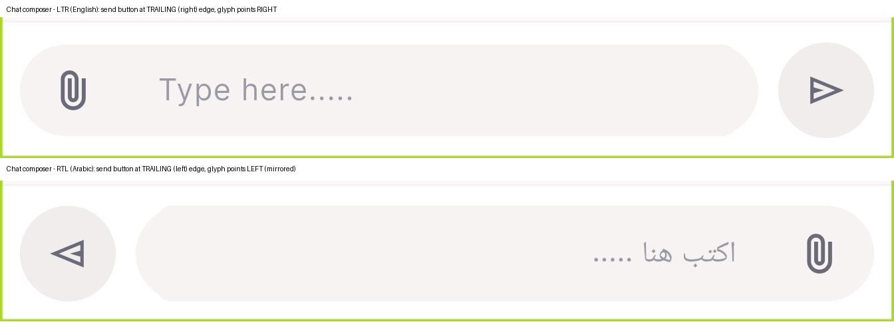
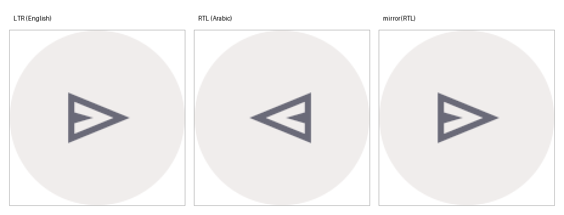

# QA Evidence — NEARS-1914

**PASS — AC1/AC3 automated (1179 DLS + 3787 UserApp, baseline 4 [E] unchanged, 0 goldens moved); AC2 demonstrated live on emulator-5556: chat send glyph MIRRORS under Arabic RTL despite mirrorForRtl:false — MSE(ltr,rtl)=675.0 vs MSE(ltr,mirror(rtl))=0.0**

**2 screenshot(s).** Click any thumbnail for full resolution.

<table>
<tr>
<td align="center" width="33%"> ac2 chat composer ltr vs rtl</td>
<td align="center" width="33%"> ac2 send rtl mirror proof</td>
</tr>
</table>

---
*From `nears/docs/qa-evidence/NEARS-1914/` · public-repo scrub policy (no live secrets; verified clean).*
