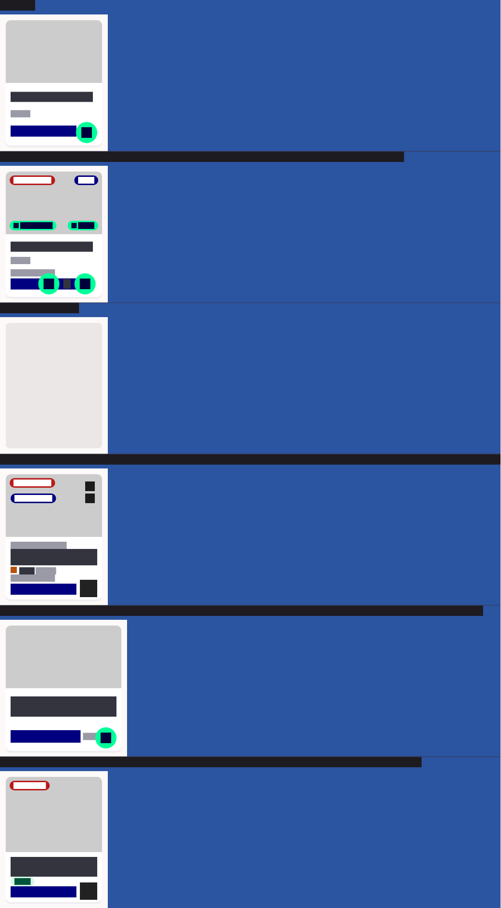
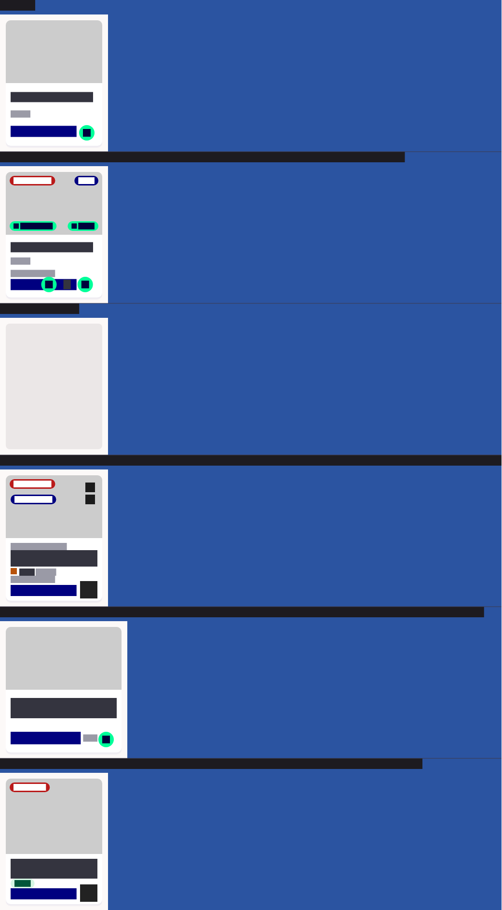
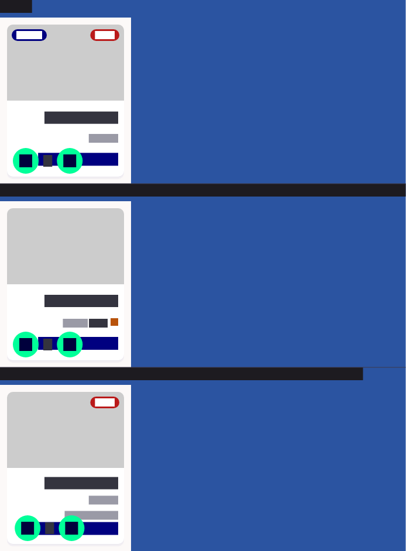

# QA Evidence — NEARS-1924

**PASS — NItemCard inline stepper 32dp -> 44dp, pixel-measured, 0 layout regression, 66/66 tests green**

**4 screenshot(s).** Click any thumbnail for full resolution.

<table>
<tr>
<td align="center" width="33%"> n item card dark AFTER 44dp</td>
<td align="center" width="33%"> n item card light AFTER 44dp</td>
<td align="center" width="33%"> n item card light BEFORE 32dp</td>
</tr>
<tr>
<td align="center" width="33%"> n item card rtl AFTER 44dp</td>
</tr>
</table>

---
*From `nears/docs/qa-evidence/NEARS-1924/` · public-repo scrub policy (no live secrets; verified clean).*
