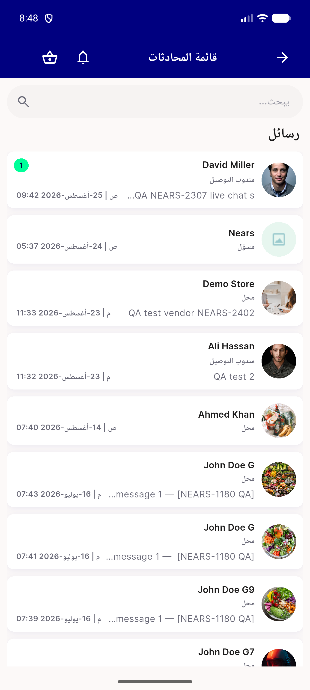
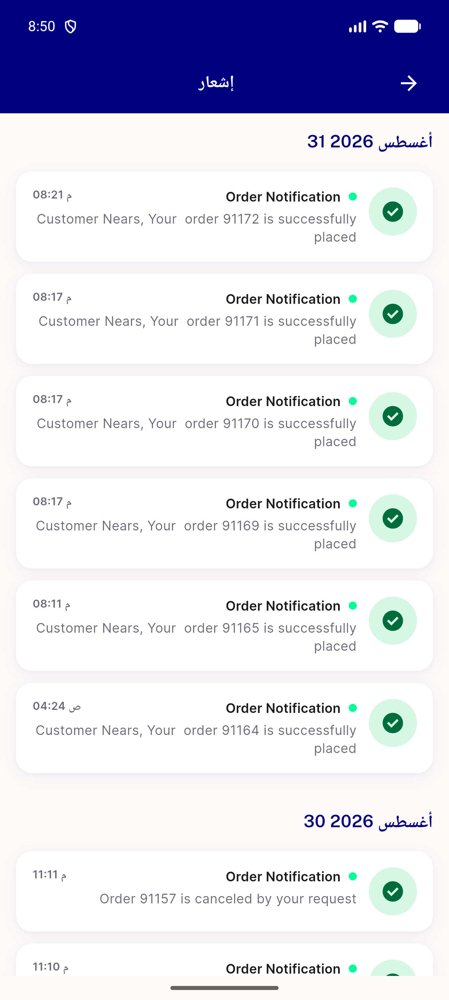
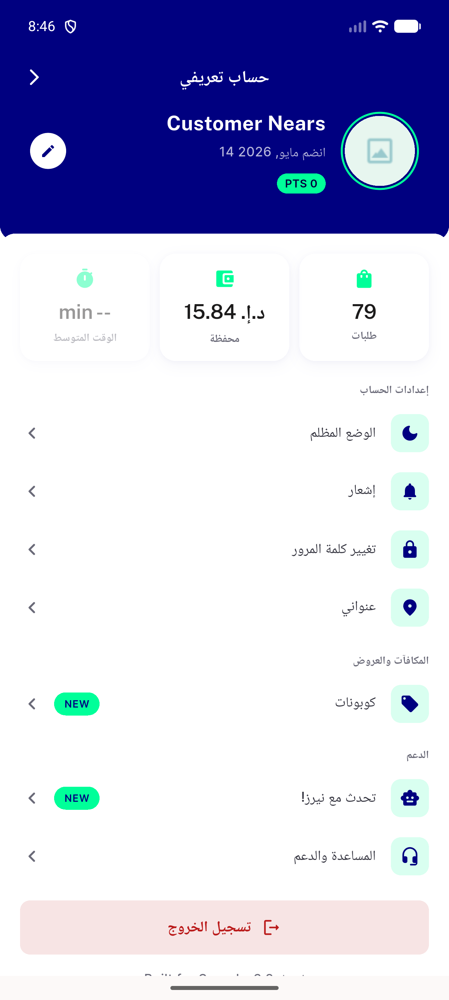
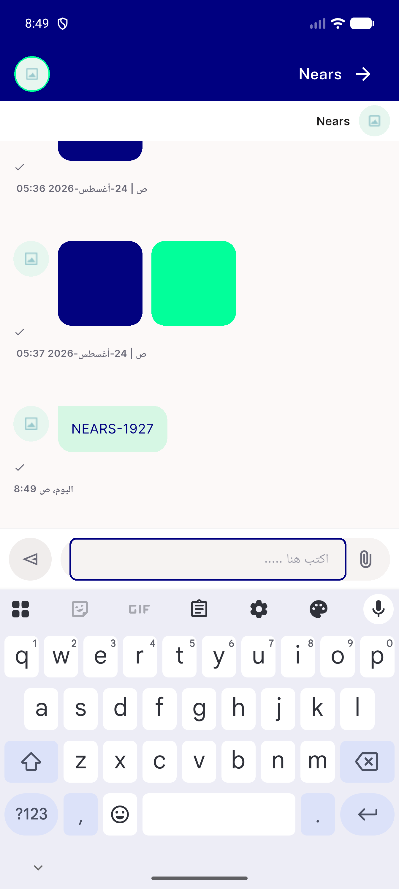
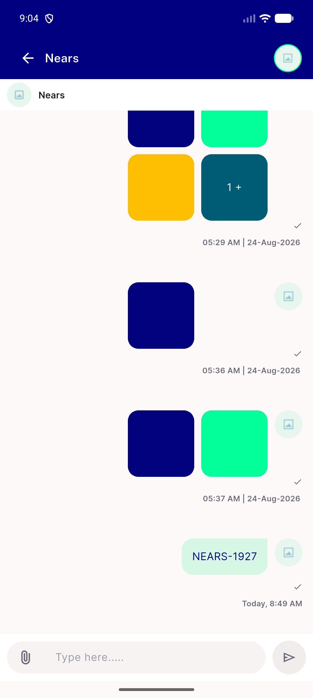
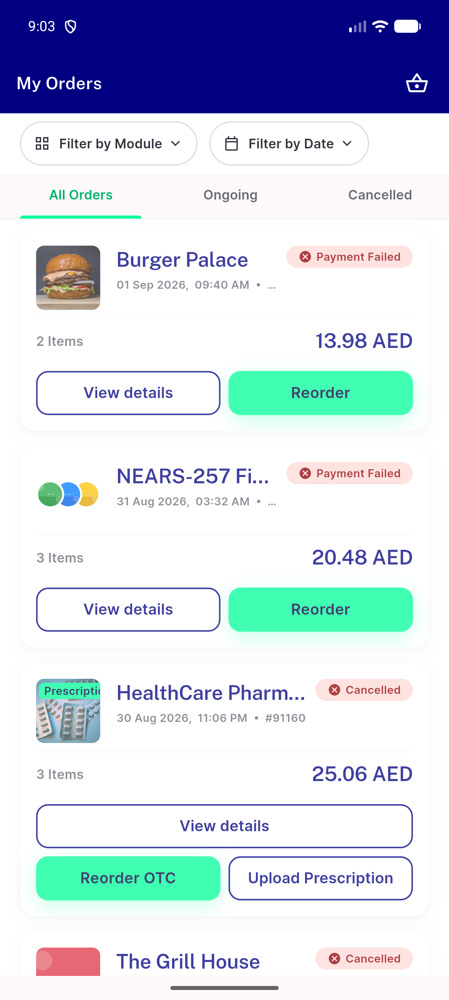
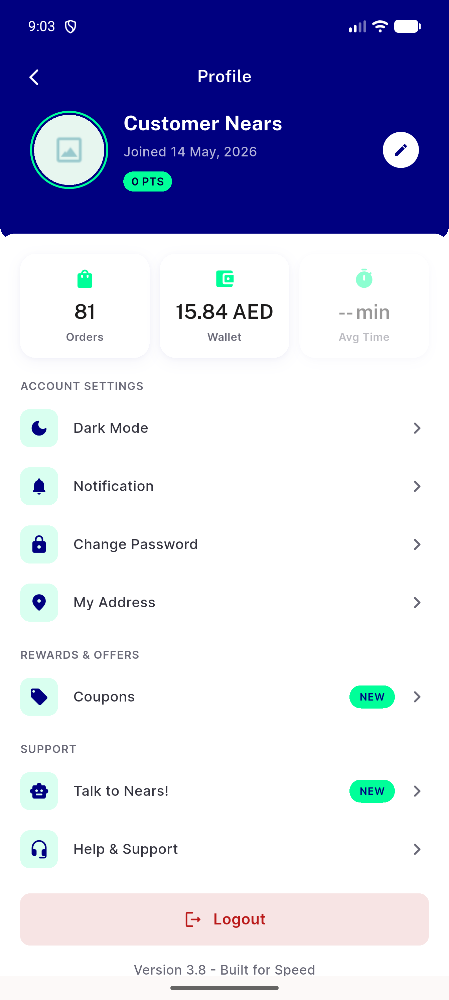

# QA Evidence — NEARS-1927

**PASS — Arabic date locale (month names, Western digits, Arabic comma separator) verified live on emulator-5562**

**9 screenshot(s).** Click any thumbnail for full resolution.

<table>
<tr>
<td align="center" width="33%"> ac1 ac2 ac3 ac4 order details ar</td>
<td align="center" width="33%"> ac1 ac2 ac3 ac4 orders list ar</td>
<td align="center" width="33%"> ac1 ac2 ac4 chat list ar</td>
</tr>
<tr>
<td align="center" width="33%"> ac1 ac2 ac4 notifications ar</td>
<td align="center" width="33%"> ac2 ac4 profile joined date ar</td>
<td align="center" width="33%"> ac5 chat today separator ar</td>
</tr>
<tr>
<td align="center" width="33%"> regression chat today separator en</td>
<td align="center" width="33%"> regression orders list en</td>
<td align="center" width="33%"> regression profile joined date en</td>
</tr>
</table>

### Other artifacts
- [`bug-checkout-timeslot-picker-unreachable.log`](bug-checkout-timeslot-picker-unreachable.log)
- [`bug-order-details-500-payment-failed-order.log`](bug-order-details-500-payment-failed-order.log)
- [`bug-preexisting-suite-failures.log`](bug-preexisting-suite-failures.log)

---
*From `nears/docs/qa-evidence/NEARS-1927/` · public-repo scrub policy (no live secrets; verified clean).*
