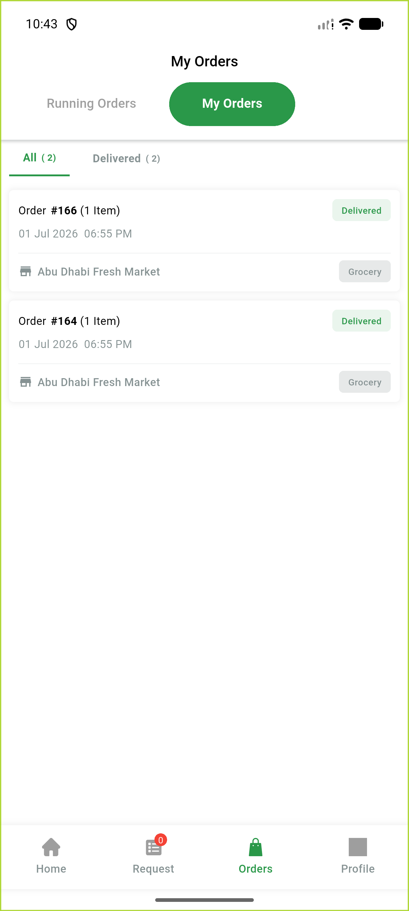
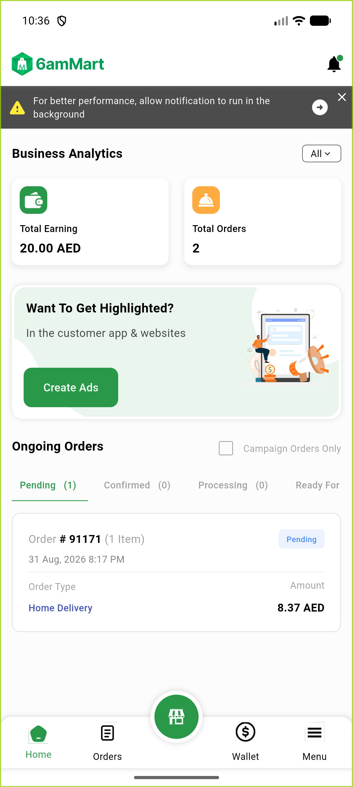

# QA Evidence — NEARS-1928

**PASS — RTL bidi date fix verified live on DeliveryApp + VendorApp (Android, Arabic locale)**

**7 screenshot(s).** Click any thumbnail for full resolution.

<table>
<tr>
<td align="center" width="33%"> delivery ar order history after</td>
<td align="center" width="33%"> delivery en order history baseline</td>
<td align="center" width="33%"> vendor ar business hours</td>
</tr>
<tr>
<td align="center" width="33%"> vendor ar coupon dates</td>
<td align="center" width="33%"> vendor ar dashboard after</td>
<td align="center" width="33%"> vendor ar tin expiry date</td>
</tr>
<tr>
<td align="center" width="33%"> vendor en dashboard baseline</td>
</tr>
</table>

### Other artifacts
- [`bidi-marks-raw-dump-excerpt.log`](bidi-marks-raw-dump-excerpt.log)

---
*From `nears/docs/qa-evidence/NEARS-1928/` · public-repo scrub policy (no live secrets; verified clean).*
