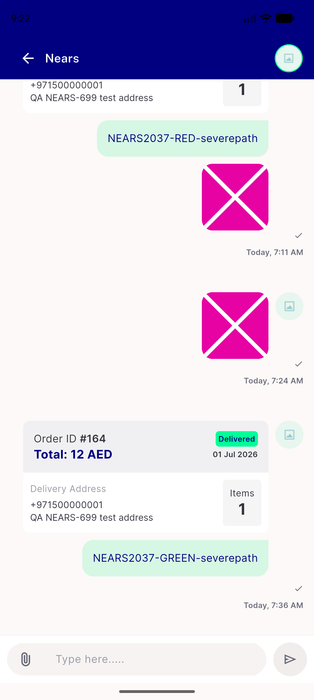
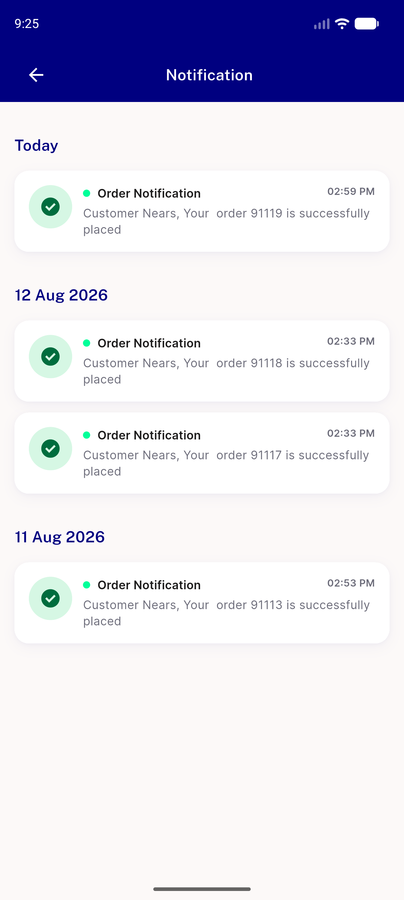
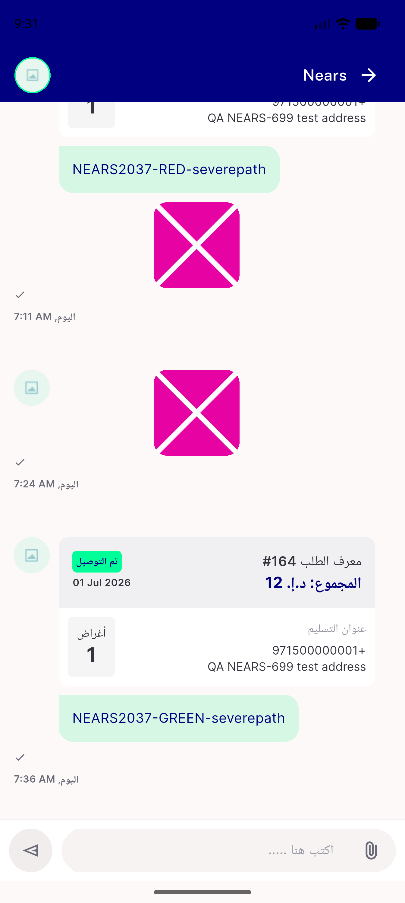

# QA Evidence — NEARS-1931

**PASS — NEARS-1931 yesterday date arithmetic: 4 live checks green on emulator-5566 (light mode), suite +3830 ~2 -4 with the 4 expected pre-existing failures; AC1-AC3 unit-pinned only, not live-observable**

**4 screenshot(s).** Click any thumbnail for full resolution.

<table>
<tr>
<td align="center" width="33%"> ac live1 chat today en</td>
<td align="center" width="33%"> ac live2 notifications today en</td>
<td align="center" width="33%"> ac live3 chat today ar</td>
</tr>
<tr>
<td align="center" width="33%"> ac live4 notifications today ar</td>
</tr>
</table>

### Other artifacts
- [`progress.md`](progress.md)

---
*From `nears/docs/qa-evidence/NEARS-1931/` · public-repo scrub policy (no live secrets; verified clean).*
