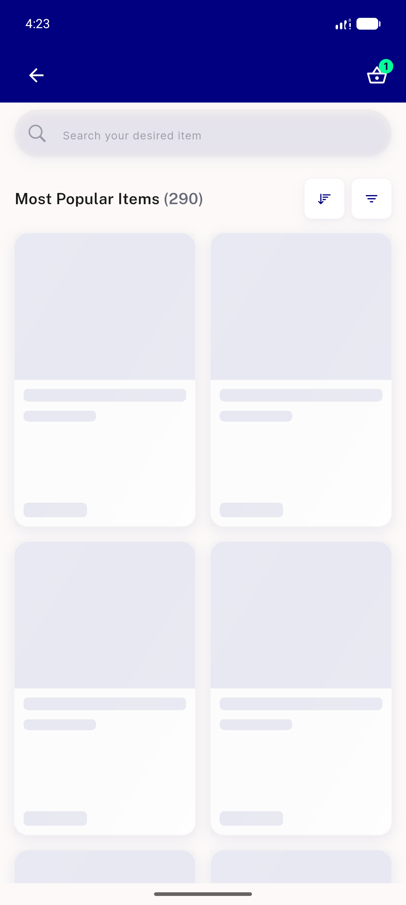
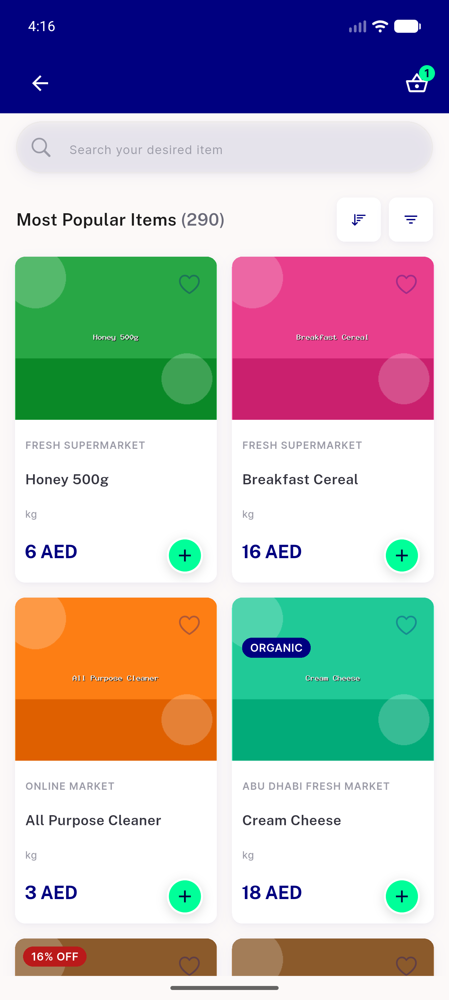
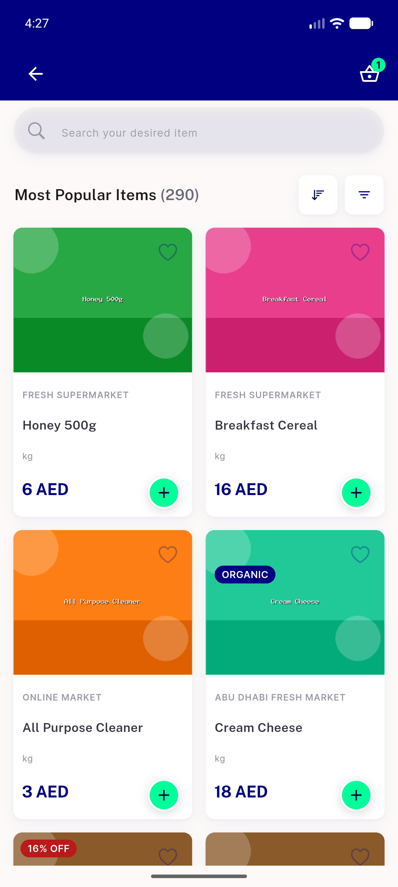
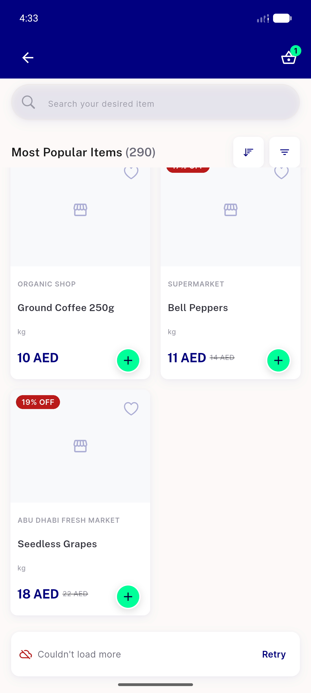
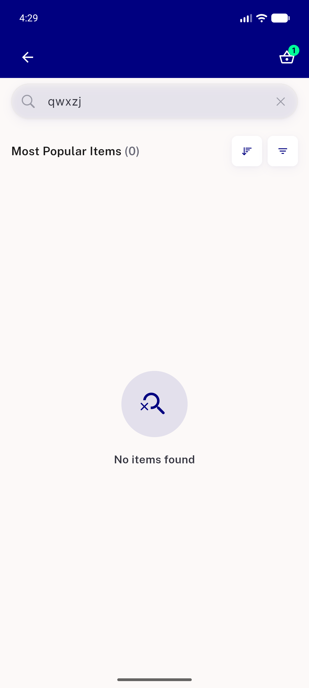
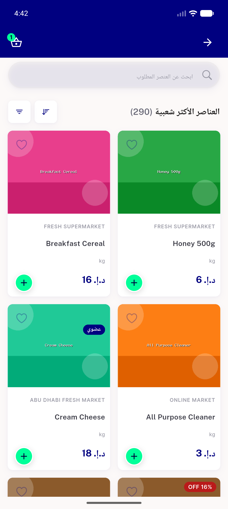

# QA Evidence — NEARS-1932

**PASS — per-axis page size: PRE(base) offline popular header showed sibling (3); POST shows own (290)**

**7 screenshot(s).** Click any thumbnail for full resolution.

<table>
<tr>
<td align="center" width="33%"> ac1 offline popular header 290</td>
<td align="center" width="33%"> ac2 visit1 popular 290</td>
<td align="center" width="33%"> ac2 visit2 popular 290 after sibling last</td>
</tr>
<tr>
<td align="center" width="33%"> prefix base offline popular shows sibling 3</td>
<td align="center" width="33%"> reg2 loadmore retry footer</td>
<td align="center" width="33%"> reg3 empty page1 shows 0</td>
</tr>
<tr>
<td align="center" width="33%"> reg4 rtl arabic popular header</td>
</tr>
</table>

---
*From `nears/docs/qa-evidence/NEARS-1932/` · public-repo scrub policy (no live secrets; verified clean).*
