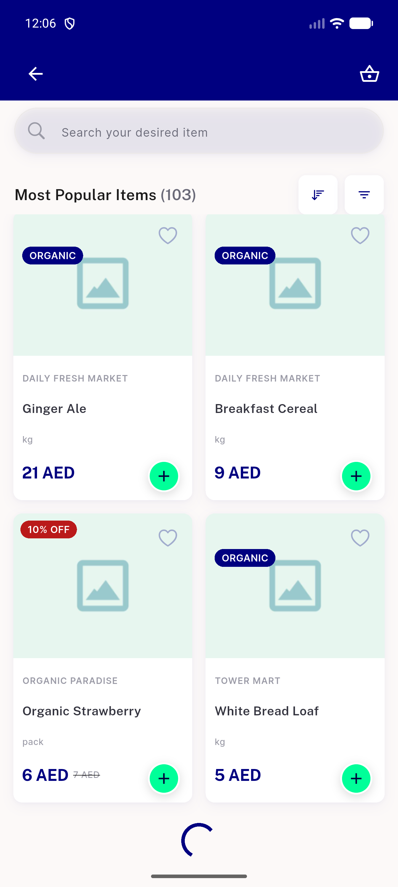
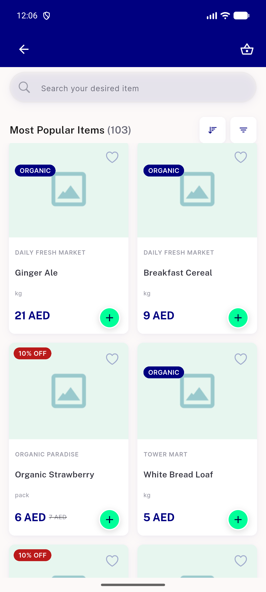

# QA Evidence — NEARS-1933

**PASS - load-more stall recipe verified live, AC1+AC2 demonstrated**

**2 screenshot(s).** Click any thumbnail for full resolution.

<table>
<tr>
<td align="center" width="33%"> ac1 loadmore inflight frozen</td>
<td align="center" width="33%"> ac1 loadmore settled after resume</td>
</tr>
</table>

### Other artifacts
- [`bug-status-no-port-exit-code.log`](bug-status-no-port-exit-code.log)

---
*From `nears/docs/qa-evidence/NEARS-1933/` · public-repo scrub policy (no live secrets; verified clean).*
