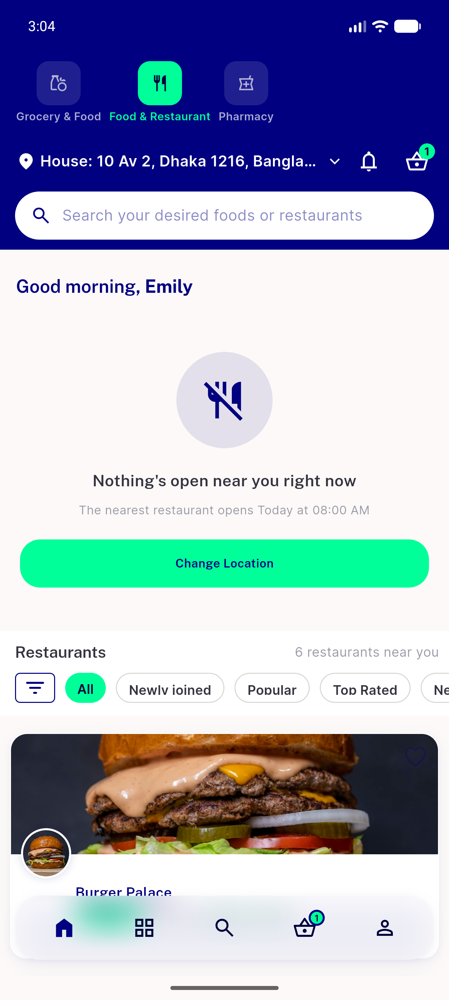
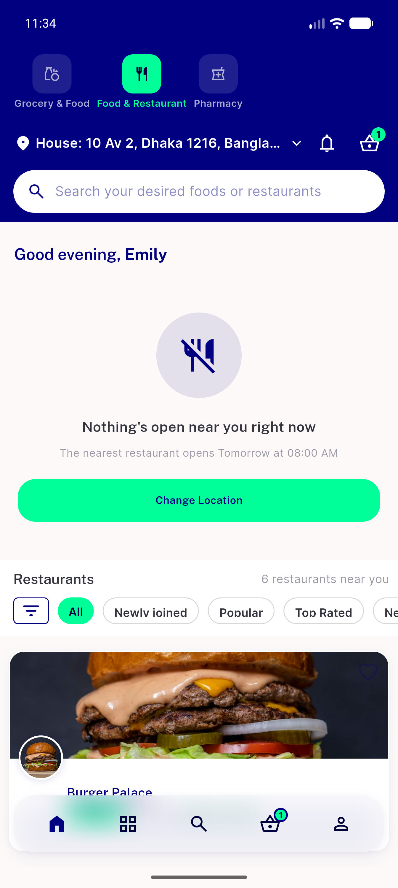
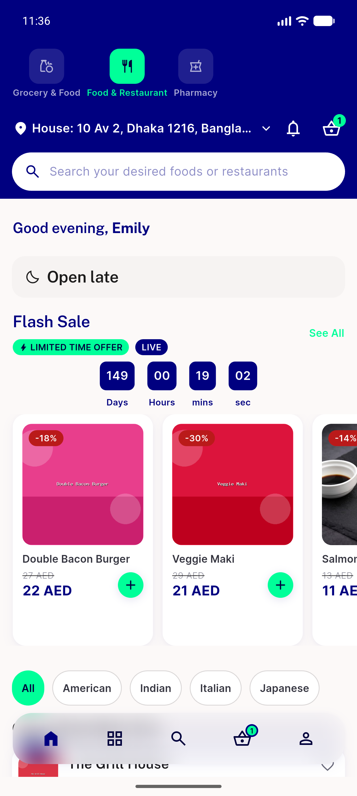
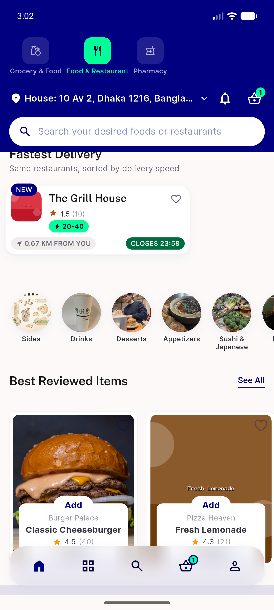
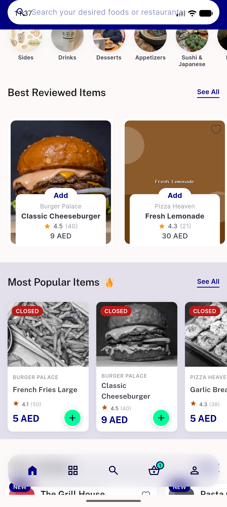

# QA Evidence — NEARS-1934

**PASS — NEARS-1934 food trading hours: before/after pair at 23:30 and 03:00, both zones**

**8 screenshot(s).** Click any thumbnail for full resolution.

<table>
<tr>
<td align="center" width="33%"> ac1 negative baseline 0300 empty state</td>
<td align="center" width="33%"> ac1 negative baseline 2333 empty state</td>
<td align="center" width="33%"> ac1 positive fixture 0300 rails</td>
</tr>
<tr>
<td align="center" width="33%"> ac1 positive fixture 2335 rails</td>
<td align="center" width="33%"> ac1 zone2 negative baseline 2334 empty state</td>
<td align="center" width="33%"> ac1 zone2 positive fixture 2330 rails</td>
</tr>
<tr>
<td align="center" width="33%"> ac2 best reviewed rail 0300</td>
<td align="center" width="33%"> ac2 both rails 2335</td>
</tr>
</table>

### Other artifacts
- [`bug-best-reviewed-rail-missing-zone2.log`](bug-best-reviewed-rail-missing-zone2.log)

---
*From `nears/docs/qa-evidence/NEARS-1934/` · public-repo scrub policy (no live secrets; verified clean).*
