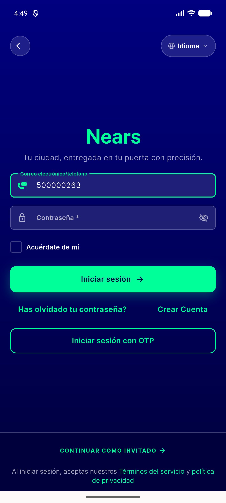

# QA Evidence — NEARS-1935

**PASS — otpLogin/loginWithSocialMedia/updatePersonalInfo/firebaseVerifyPhoneNumber throw-safety fix, UserApp emulator-5560**

**1 screenshot(s).** Click any thumbnail for full resolution.

<table>
<tr>
<td align="center" width="33%"> ac3 firebase verificationfailed recovers</td>
</tr>
</table>

---
*From `nears/docs/qa-evidence/NEARS-1935/` · public-repo scrub policy (no live secrets; verified clean).*
