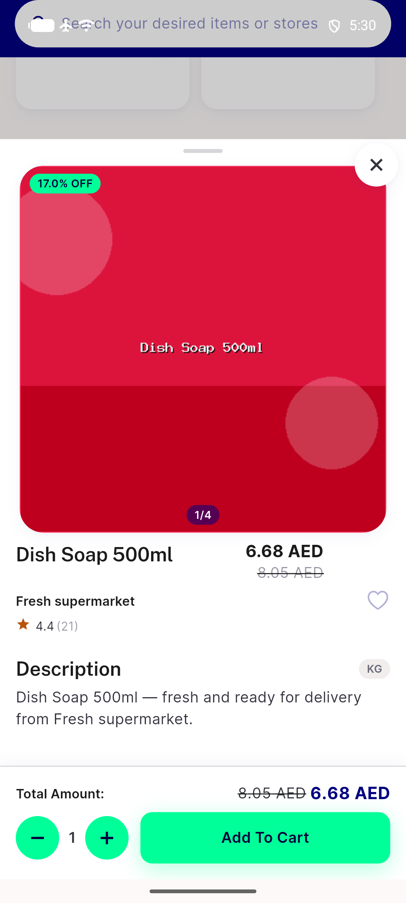

# QA Evidence — NEARS-1936

**PASS -- NBottomSheet opaque-default fix verified live, light mode, emulator-5562**

**3 screenshot(s).** Click any thumbnail for full resolution.

<table>
<tr>
<td align="center" width="33%"> ac1 bare nbottomsheet widget probe</td>
<td align="center" width="33%"> ac2 item bottom sheet</td>
<td align="center" width="33%"> regression rtl item sheet</td>
</tr>
</table>

---
*From `nears/docs/qa-evidence/NEARS-1936/` · public-repo scrub policy (no live secrets; verified clean).*
