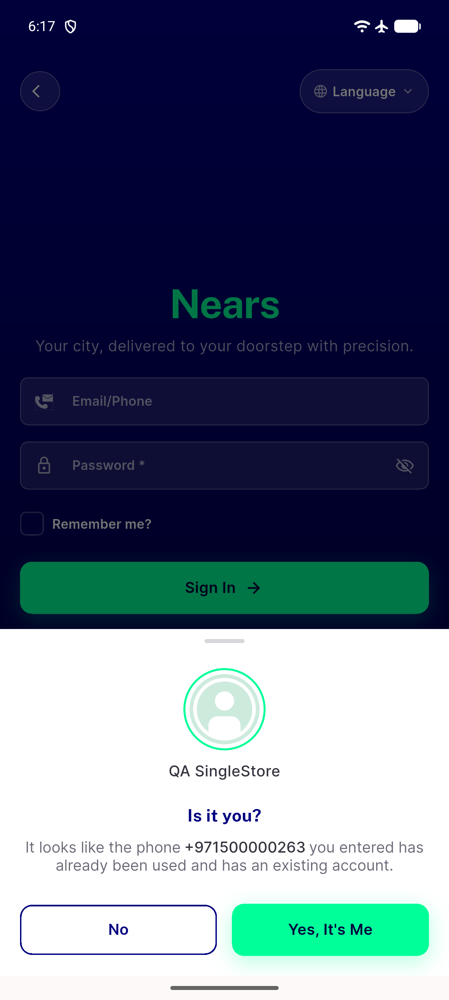
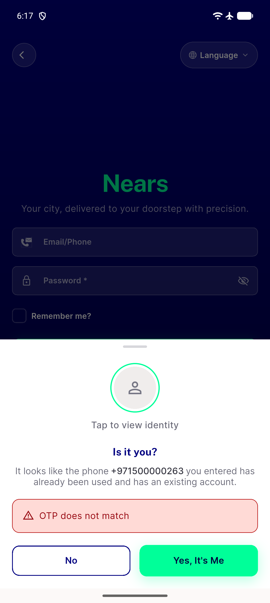
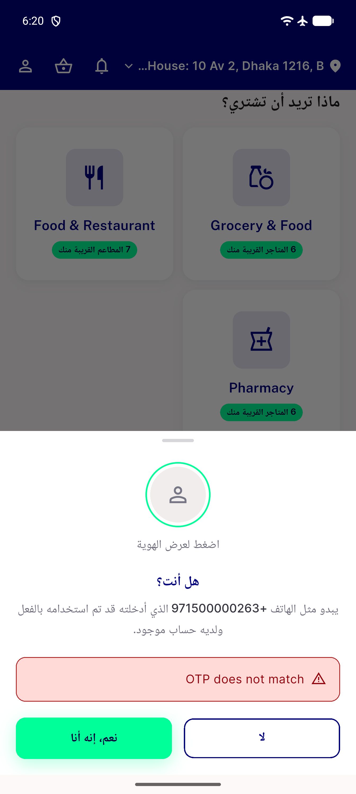
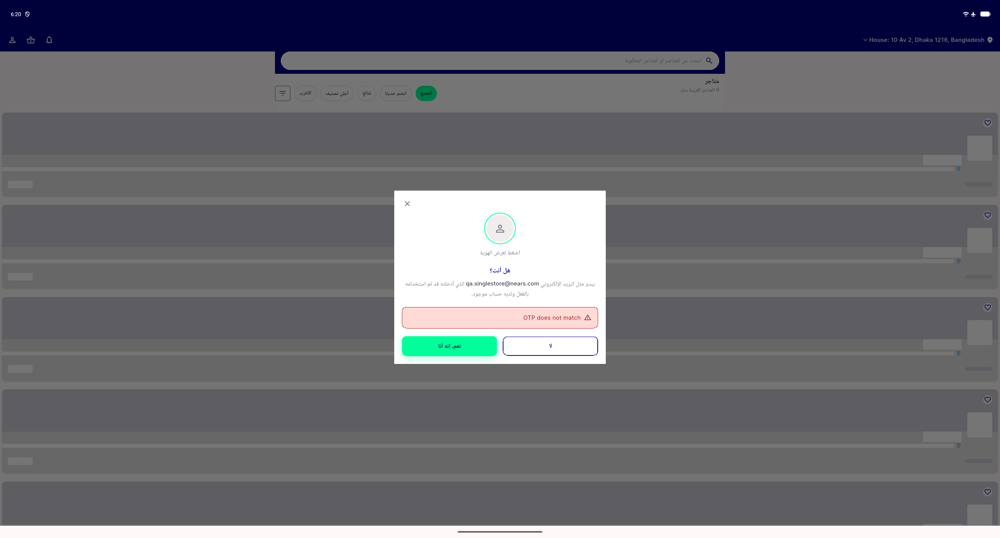

# QA Evidence — NEARS-1937

**PASS - existing-user identity masking/reveal/re-mask/retry-safety verified live (emulator-5558)**

**5 screenshot(s).** Click any thumbnail for full resolution.

<table>
<tr>
<td align="center" width="33%"> clean mount unmasked</td>
<td align="center" width="33%"> masked after failure</td>
<td align="center" width="33%"> retry stays masked</td>
</tr>
<tr>
<td align="center" width="33%"> rtl arabic masked</td>
<td align="center" width="33%"> desktop masked</td>
</tr>
</table>

---
*From `nears/docs/qa-evidence/NEARS-1937/` · public-repo scrub policy (no live secrets; verified clean).*
