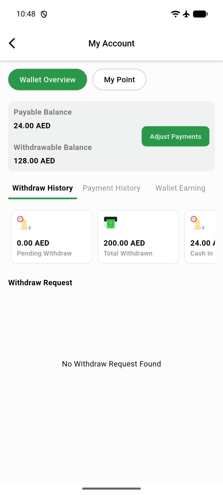
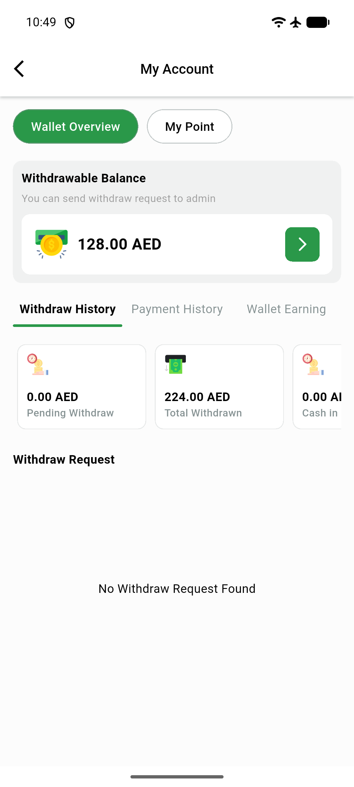
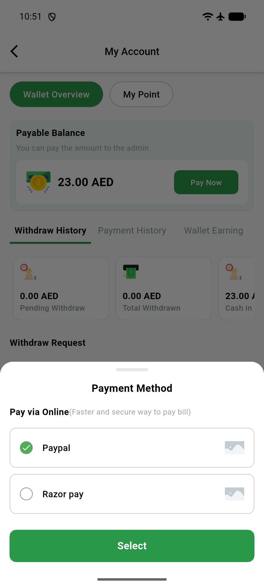

# QA Evidence — NEARS-1939

**PASS — AC1/AC2/AC3 demonstrated live on emulator-5564 (Android), DeliveryApp; regression sweep clean**

**3 screenshot(s).** Click any thumbnail for full resolution.

<table>
<tr>
<td align="center" width="33%"> ac1 error toast</td>
<td align="center" width="33%"> ac3 success toast</td>
<td align="center" width="33%"> regression collect cash no toast</td>
</tr>
</table>

### Other artifacts
- [`ac1-fail-log-excerpt.log`](ac1-fail-log-excerpt.log)
- [`regression-collect-cash-fail-log-excerpt.log`](regression-collect-cash-fail-log-excerpt.log)

---
*From `nears/docs/qa-evidence/NEARS-1939/` · public-repo scrub policy (no live secrets; verified clean).*
