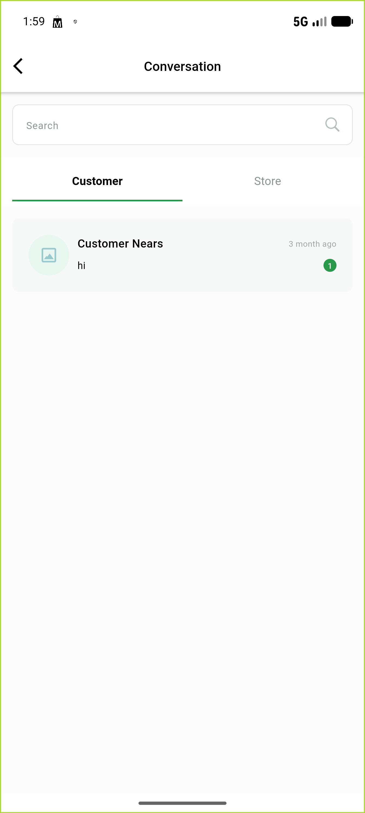
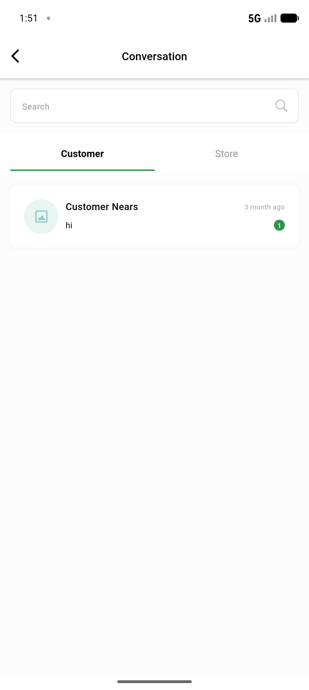
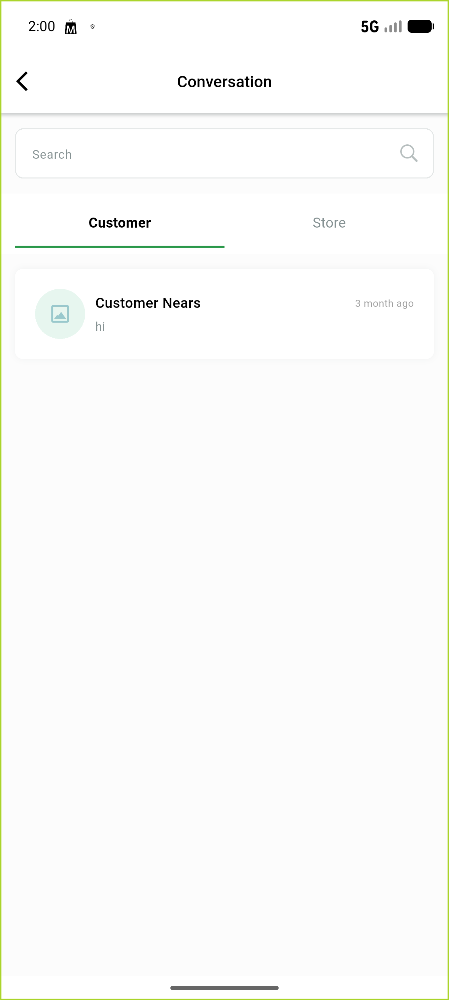

# QA Evidence — NEARS-1941

**PASS - AC1 unread tint confirmed via pixel-level before/after proof on correct worktree build (retry_4, cycle 2)**

**5 screenshot(s).** Click any thumbnail for full resolution.

<table>
<tr>
<td align="center" width="33%"> ac1 unread tint retry4 correct tree</td>
<td align="center" width="33%"> ac1 unread tint retry4</td>
<td align="center" width="33%"> ac1 unseen conversation unread tint</td>
</tr>
<tr>
<td align="center" width="33%"> ac2 read conversation normal styling</td>
<td align="center" width="33%"> ac2 same row after read</td>
</tr>
</table>

### Other artifacts
- [`bug-ac1-tint-senderid-inverted.log`](bug-ac1-tint-senderid-inverted.log)

---
*From `nears/docs/qa-evidence/NEARS-1941/` · public-repo scrub policy (no live secrets; verified clean).*
