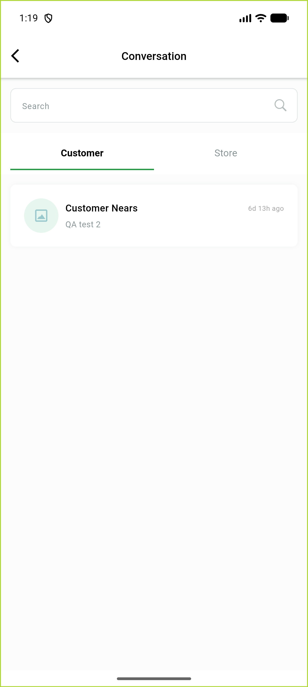

# QA Evidence — NEARS-1941

**FAIL — AC1 still fails live: unread tint never renders for its own described scenario (senderId comparison inverted, separate defect from the isSeen fix); AC2/AC3 remain PASS (carried forward)**

**2 screenshot(s).** Click any thumbnail for full resolution.

<table>
<tr>
<td align="center" width="33%"> ac1 unseen conversation unread tint</td>
<td align="center" width="33%"> ac2 read conversation normal styling</td>
</tr>
</table>

### Other artifacts
- [`bug-ac1-tint-senderid-inverted.log`](bug-ac1-tint-senderid-inverted.log)

---
*From `nears/docs/qa-evidence/NEARS-1941/` · public-repo scrub policy (no live secrets; verified clean).*
