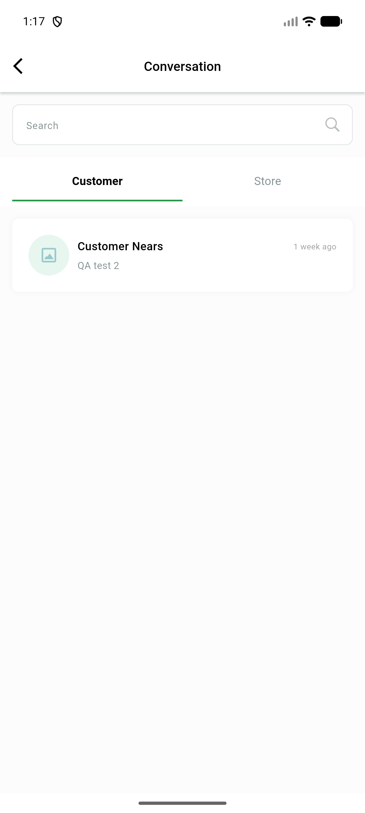

# QA Evidence — NEARS-1941

**m4-retry2: AC1 BLOCKED (Data DoR gap, td@td.com credential mismatch) — AC2/AC3 PASS**

**1 screenshot(s).** Click any thumbnail for full resolution.

<table>
<tr>
<td align="center" width="33%"> ac2 reconfirm read conversation no tint</td>
</tr>
</table>

### Other artifacts
- [`blocker-ac1-td-login-401.log`](blocker-ac1-td-login-401.log)

---
*From `nears/docs/qa-evidence/NEARS-1941/` · public-repo scrub policy (no live secrets; verified clean).*
