# QA Evidence — NEARS-1942

**PASS - AC1/AC2/AC3/AC4 verified live on emulator-5564, light mode, EN+RTL**

**15 screenshot(s).** Click any thumbnail for full resolution.

<table>
<tr>
<td align="center" width="33%"><a href="qa8_signin_en_email_mode.png">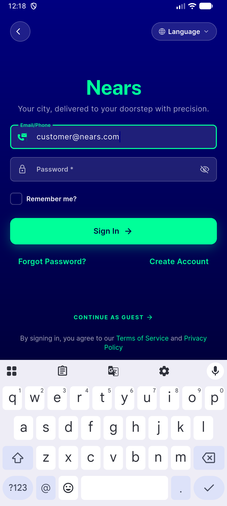</a> qa8 signin en email mode</td>
<td align="center" width="33%"><a href="qa8_signin_en_phone_mode.png">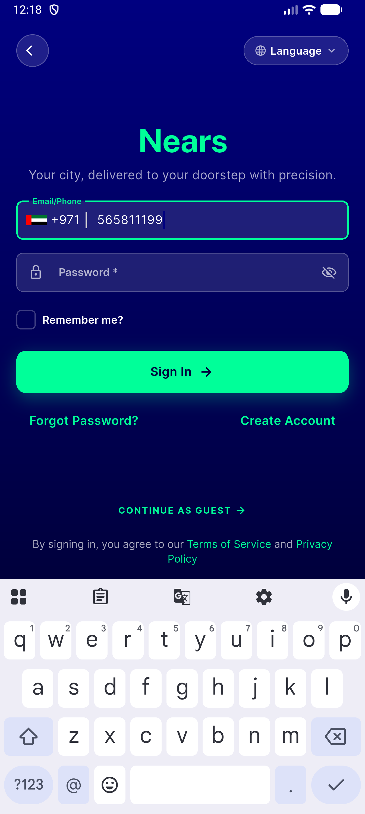</a> qa8 signin en phone mode</td>
<td align="center" width="33%"><a href="qa8_signin_en_unfocused.png">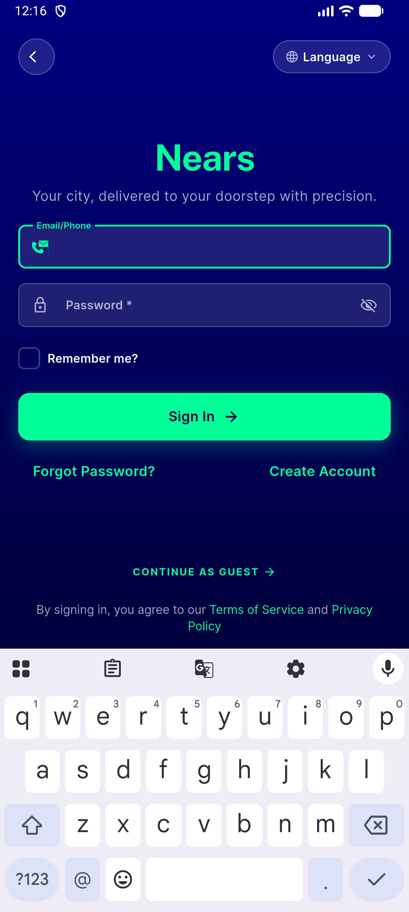</a> qa8 signin en unfocused</td>
</tr>
<tr>
<td align="center" width="33%"><a href="qa8_signin_en_unfocused2.png">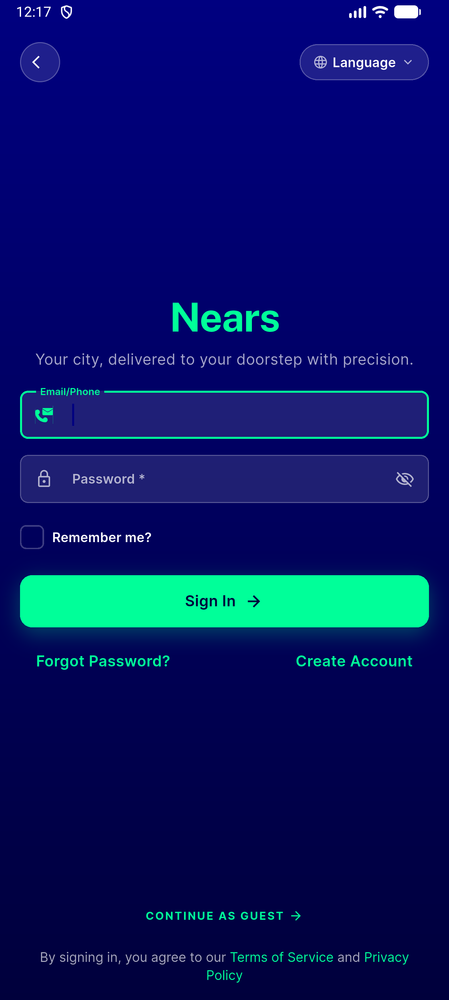</a> qa8 signin en unfocused2</td>
<td align="center" width="33%"><a href="qa8_signin_en_unfocused3.png">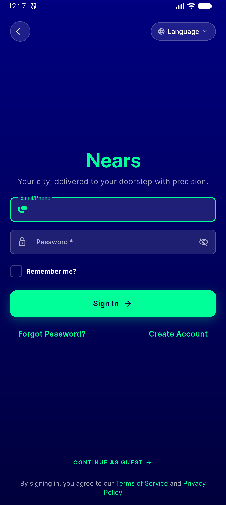</a> qa8 signin en unfocused3</td>
<td align="center" width="33%"><a href="qa8_signin_en_unfocused4.png">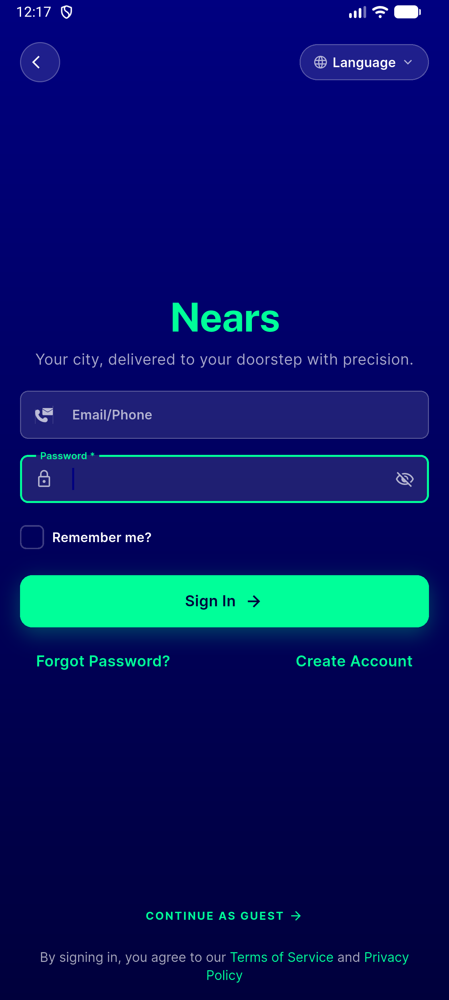</a> qa8 signin en unfocused4</td>
</tr>
<tr>
<td align="center" width="33%"><a href="qa8_signin_rtl_unfocused.png">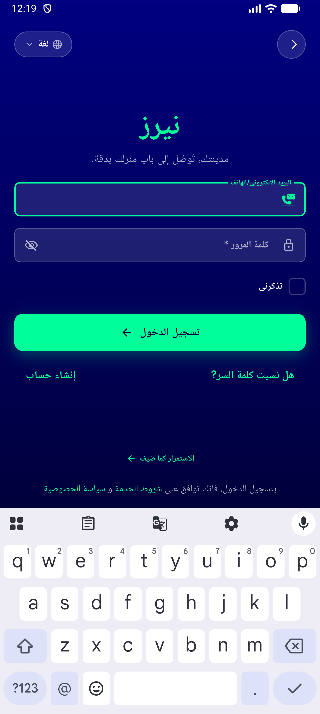</a> qa8 signin rtl unfocused</td>
<td align="center" width="33%"><a href="qa8_signin_rtl_unfocused2.png">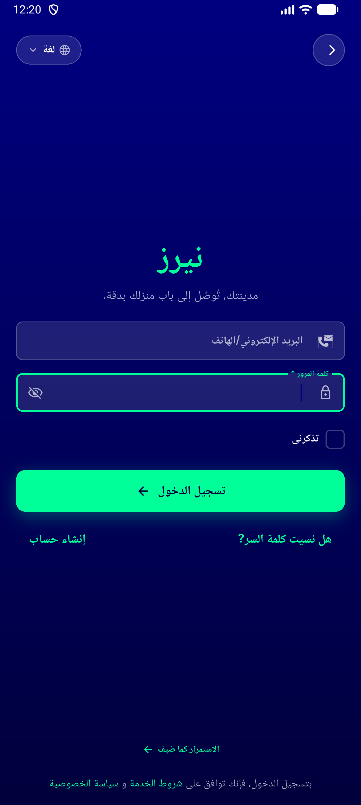</a> qa8 signin rtl unfocused2</td>
<td align="center" width="33%"><a href="qa8_signup_rtl_focused_check.png">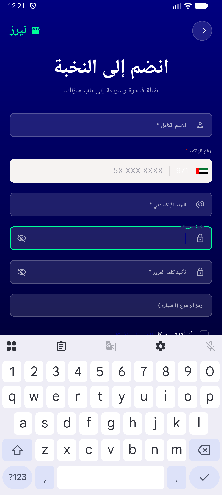</a> qa8 signup rtl focused check</td>
</tr>
<tr>
<td align="center" width="33%"><a href="qa8_signup_rtl_regression.png">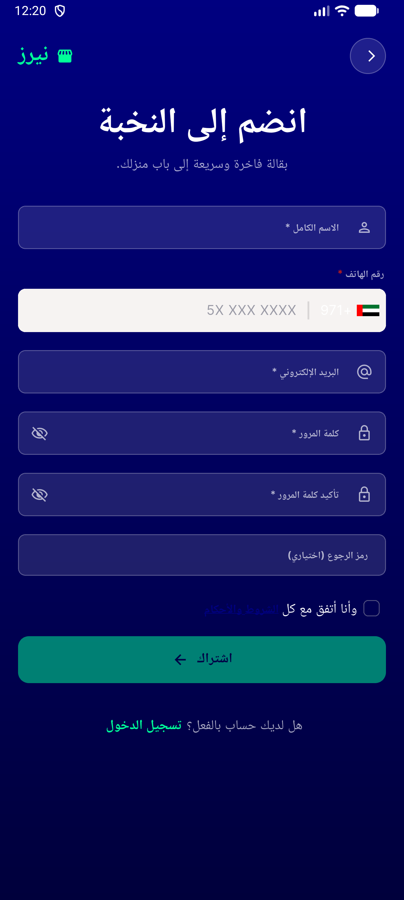</a> qa8 signup rtl regression</td>
<td align="center" width="33%"><a href="signin_en_focused.png">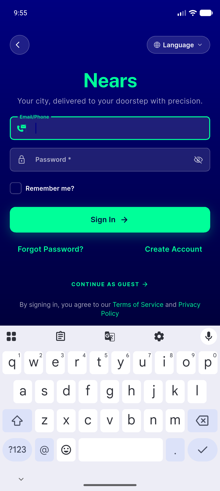</a> signin en focused</td>
<td align="center" width="33%"><a href="signin_en_phone_mode.png">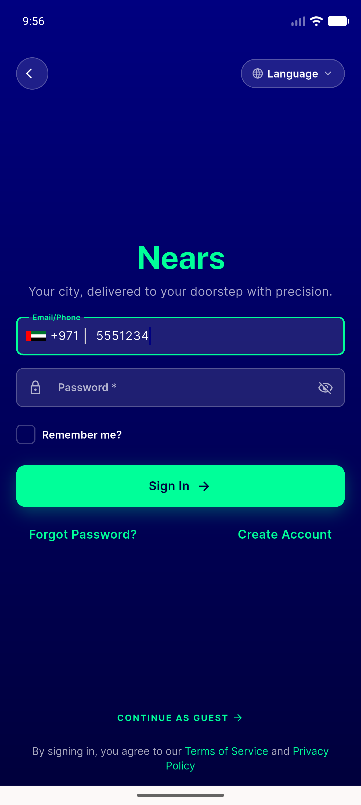</a> signin en phone mode</td>
</tr>
<tr>
<td align="center" width="33%"><a href="signin_en_unfocused.png">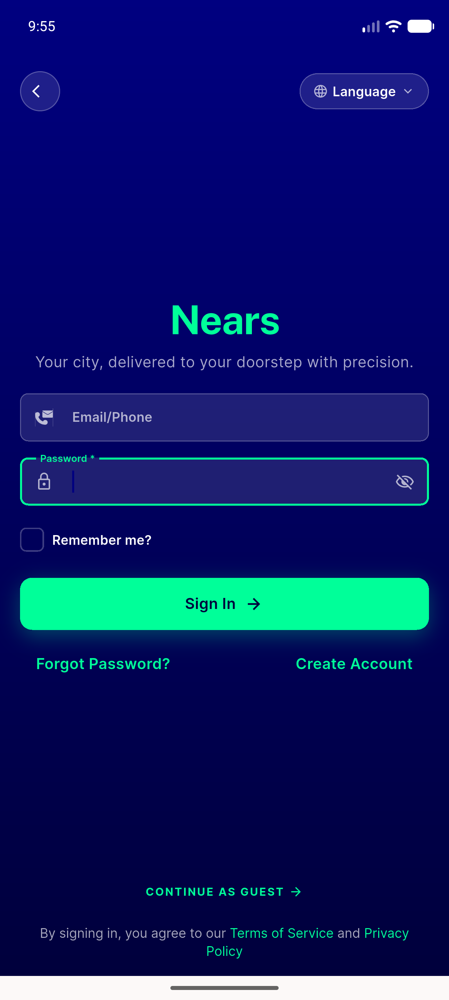</a> signin en unfocused</td>
<td align="center" width="33%"><a href="signin_rtl_focused.png">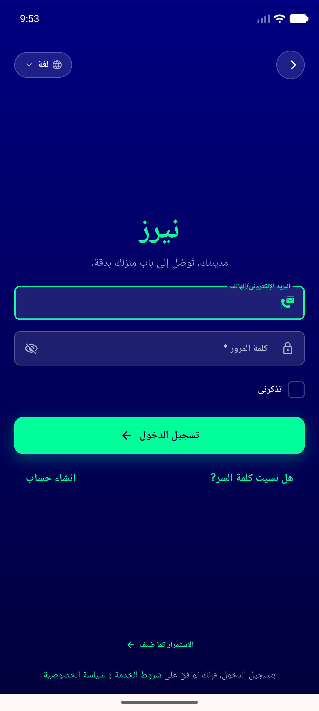</a> signin rtl focused</td>
<td align="center" width="33%"><a href="signin_rtl_unfocused.png">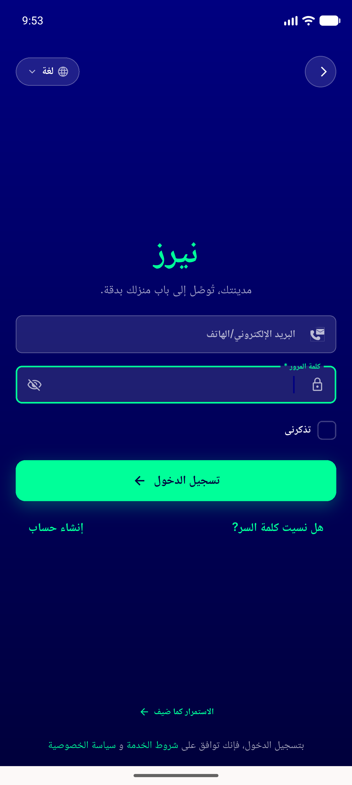</a> signin rtl unfocused</td>
</tr>
</table>

---
*From `nears/docs/qa-evidence/NEARS-1942/` · public-repo scrub policy (no live secrets; verified clean).*
