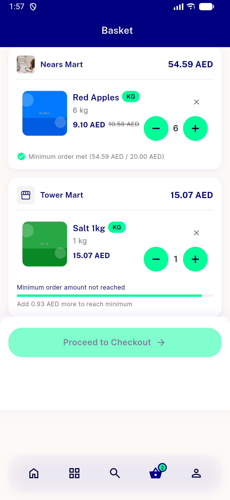
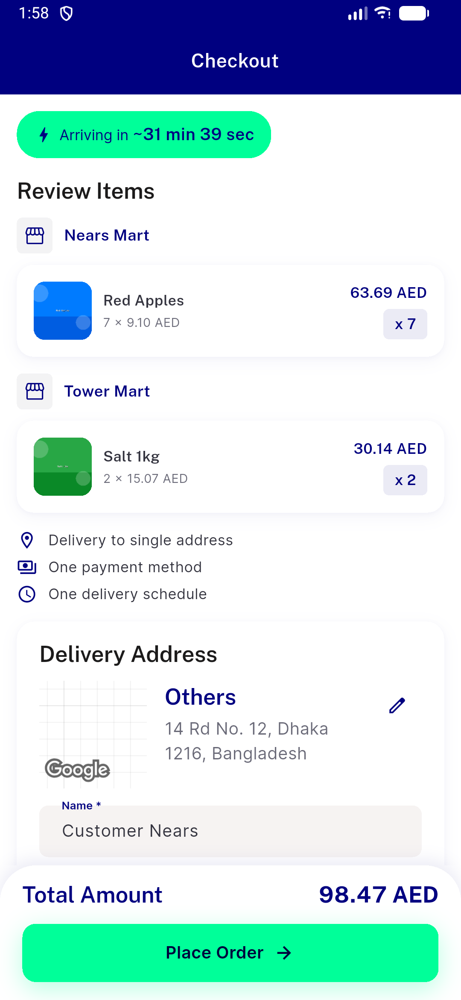

# QA Evidence — NEARS-1944

**PASS — checkout gate @amount placeholder fix verified; en+ar interpolation confirmed live, widget tests GREEN (12/12), 316 checkout regression tests clean, 1 pre-existing unrelated overflow logged as regression**

**3 screenshot(s).** Click any thumbnail for full resolution.

<table>
<tr>
<td align="center" width="33%"> ac1 cart minimum substitution ar</td>
<td align="center" width="33%"> ac1 cart minimum substitution en</td>
<td align="center" width="33%"> ac4 multistore above minimum no gate en</td>
</tr>
</table>

### Other artifacts
- [`bug-extra-discount-row-render-overflow.log`](bug-extra-discount-row-render-overflow.log)

---
*From `nears/docs/qa-evidence/NEARS-1944/` · public-repo scrub policy (no live secrets; verified clean).*
