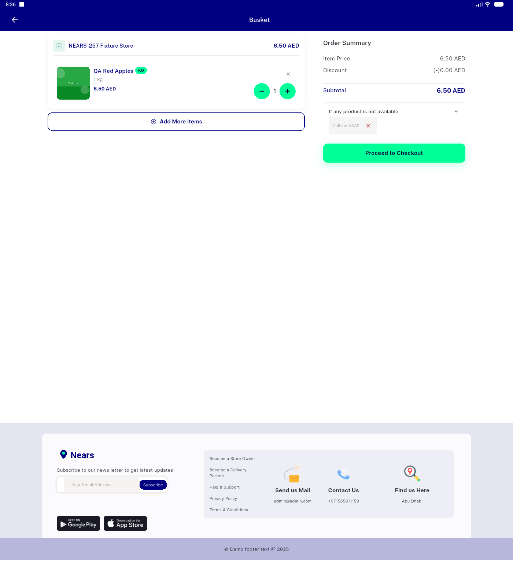
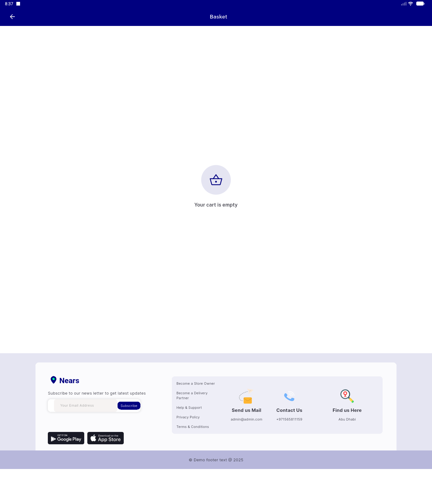
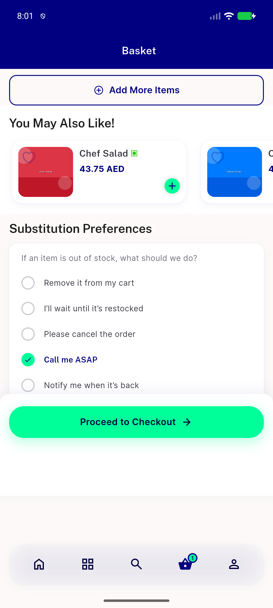

# QA Evidence — NEARS-1945

**PASS delta re-QA — AC4 crash fix confirmed mobile+desktop, empty-cart guard holds, logging unaffected**

**3 screenshot(s).** Click any thumbnail for full resolution.

<table>
<tr>
<td align="center" width="33%"> ac4 delta desktop cart populated</td>
<td align="center" width="33%"> ac4 delta desktop empty cart no crash</td>
<td align="center" width="33%"> bug ordersummary rangeerror</td>
</tr>
</table>

### Other artifacts
- [`bug-ordersummary-rangeerror.log`](bug-ordersummary-rangeerror.log)

---
*From `nears/docs/qa-evidence/NEARS-1945/` · public-repo scrub policy (no live secrets; verified clean).*
