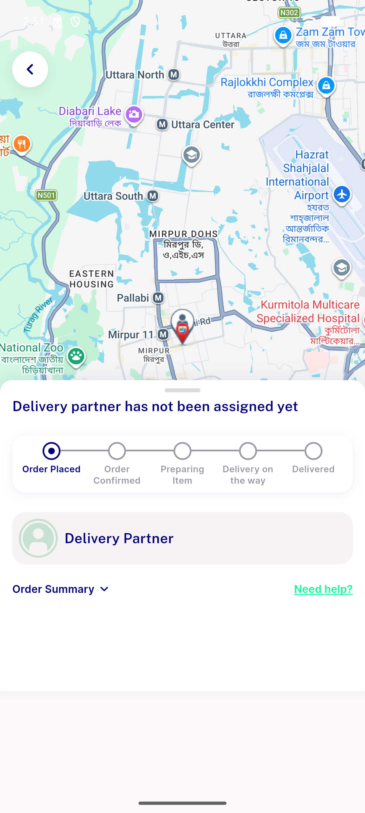

# QA Evidence — NEARS-1946

**PASS - schedule_at slot-boundary fix verified live: first/middle(repro)/last slots all inside window, no 422, HEX clean (NEARS-1708 guard), group-order path + surge lookup verified, 320 checkout unit tests green**

**1 screenshot(s).** Click any thumbnail for full resolution.

<table>
<tr>
<td align="center" width="33%"> order confirmed last slot</td>
</tr>
</table>

### Other artifacts
- [`automated-backstop.log`](automated-backstop.log)
- [`db-schedule-at-verification.log`](db-schedule-at-verification.log)

---
*From `nears/docs/qa-evidence/NEARS-1946/` · public-repo scrub policy (no live secrets; verified clean).*
