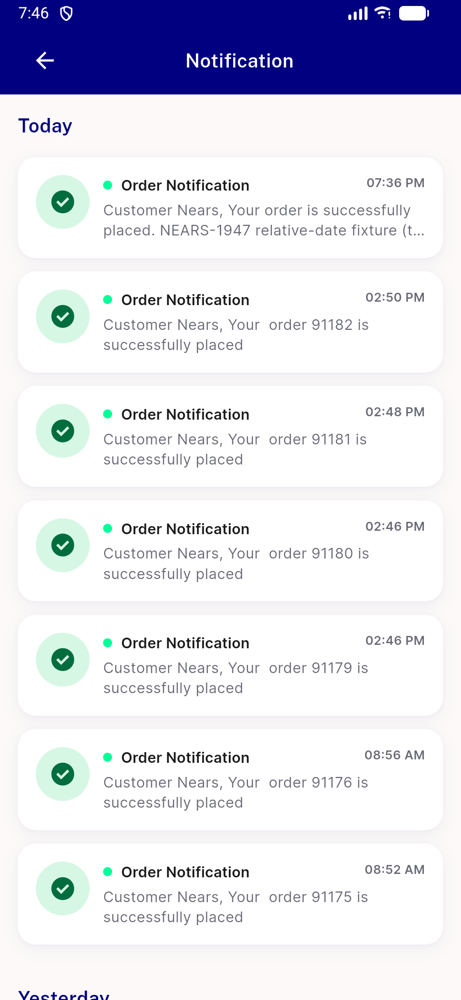
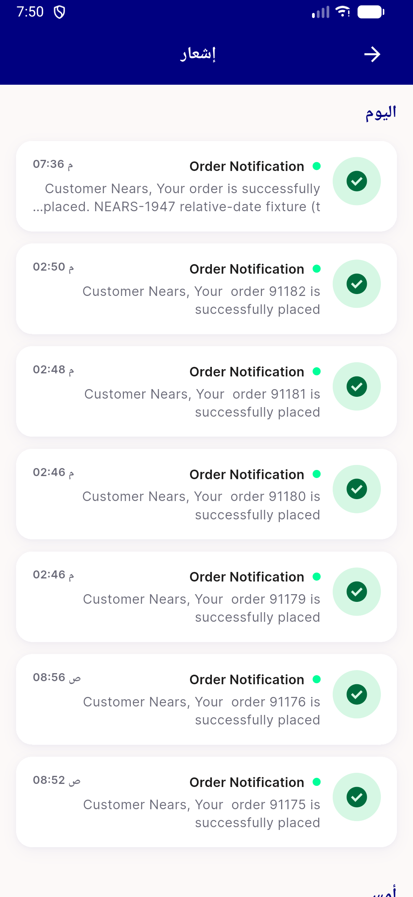

# QA Evidence — NEARS-1947

**PASS — Today/Yesterday headers (EN+AR) live, seeder idempotent, no data loss**

**2 screenshot(s).** Click any thumbnail for full resolution.

<table>
<tr>
<td align="center" width="33%"> ac1 ac2 en today yesterday</td>
<td align="center" width="33%"> ac2 ar yesterday amis</td>
</tr>
</table>

---
*From `nears/docs/qa-evidence/NEARS-1947/` · public-repo scrub policy (no live secrets; verified clean).*
