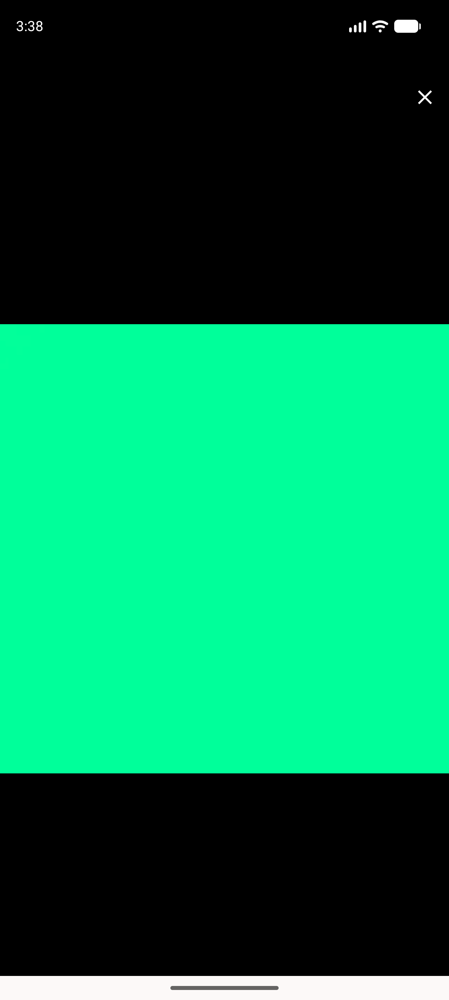

# QA Evidence — NEARS-1950

**PASS — lightbox SafeArea gates: zero user-visible delta, Close 20.0dp clear, no overflow**

**2 screenshot(s).** Click any thumbnail for full resolution.

<table>
<tr>
<td align="center" width="33%"> ac1 lightbox close and pane</td>
<td align="center" width="33%"> ac1 lightbox reopen</td>
</tr>
</table>

### Other artifacts
- [`progress.md`](progress.md)

---
*From `nears/docs/qa-evidence/NEARS-1950/` · public-repo scrub policy (no live secrets; verified clean).*
