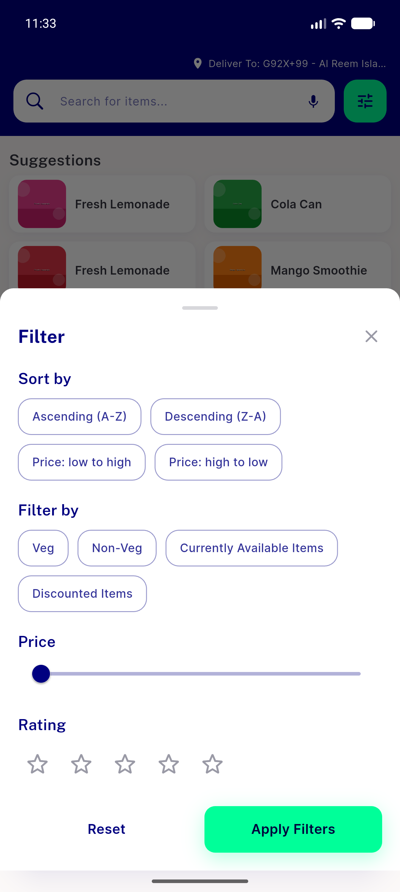
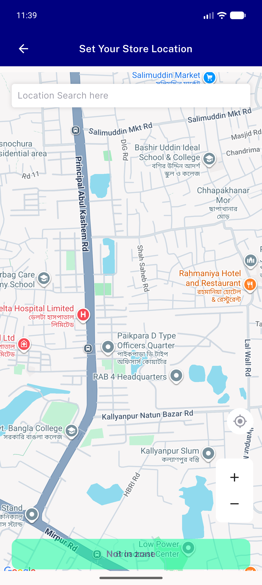
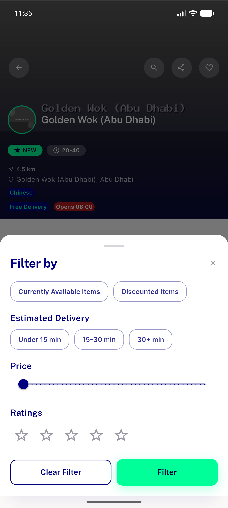
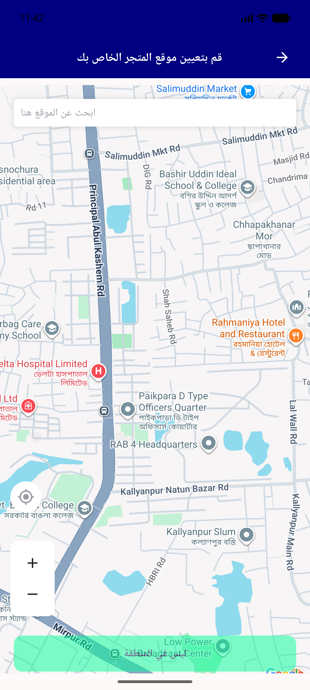

# QA Evidence — NEARS-1951

**PASS - navy-fill decoration removed at 3 sites, 44dp tap boxes verified, semantics/RTL live-confirmed**

**4 screenshot(s).** Click any thumbnail for full resolution.

<table>
<tr>
<td align="center" width="33%"> ac2 search filter rating stars</td>
<td align="center" width="33%"> ac2 select location zoom controls</td>
<td align="center" width="33%"> ac2 store filter rating stars</td>
</tr>
<tr>
<td align="center" width="33%"> rtl select location zoom controls</td>
</tr>
</table>

### Other artifacts
- [`bug-chat-attachment-viewer-compile-error.log`](bug-chat-attachment-viewer-compile-error.log)

---
*From `nears/docs/qa-evidence/NEARS-1951/` · public-repo scrub policy (no live secrets; verified clean).*
