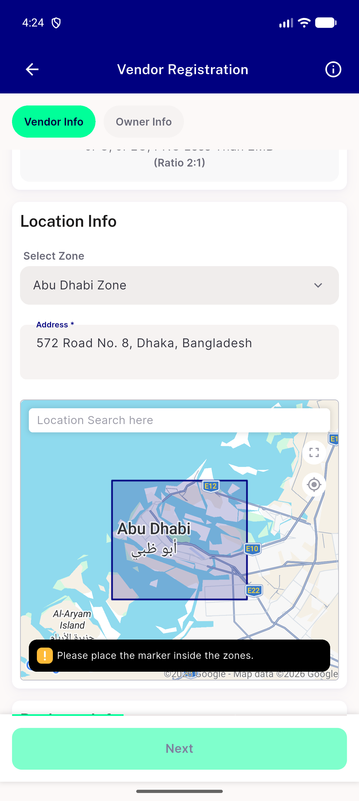
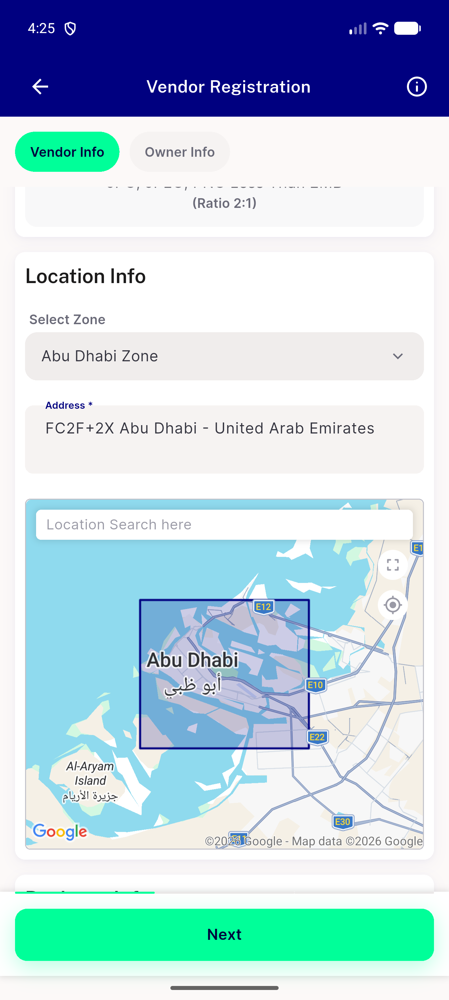
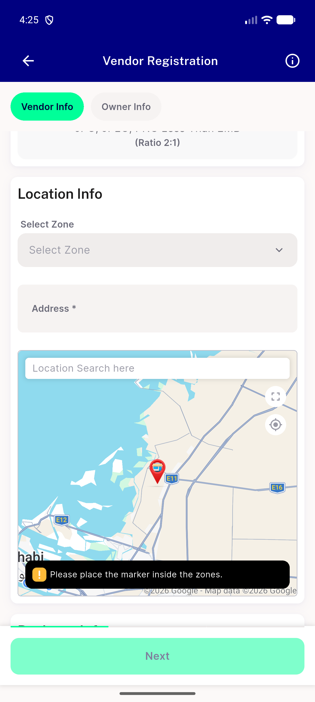
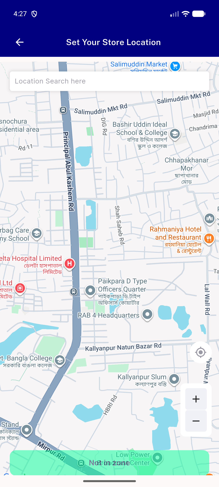
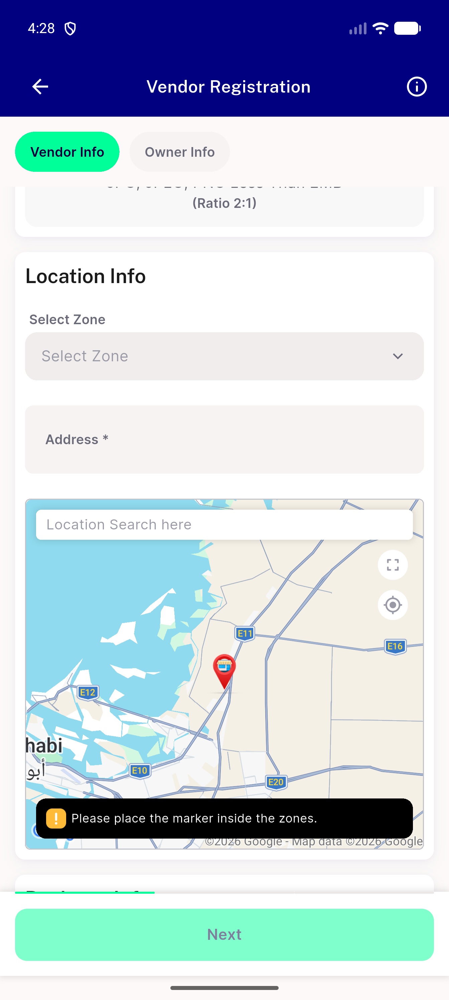

# QA Evidence — NEARS-1952

**PASS — NEARS-1952 post-merge two-sided tap-boundary confirmation: effective tap area == declared 44dp box on all four boundaries (emulator-5562)**

**6 screenshot(s).** Click any thumbnail for full resolution.

<table>
<tr>
<td align="center" width="33%"> followup 00 before positive</td>
<td align="center" width="33%"> followup 01 positive T+2dp</td>
<td align="center" width="33%"> followup 02 before negative</td>
</tr>
<tr>
<td align="center" width="33%"> followup 03 negative T 2dp</td>
<td align="center" width="33%"> followup 04 positive B 2dp</td>
<td align="center" width="33%"> followup 05 negative B+2dp</td>
</tr>
</table>

---
*From `nears/docs/qa-evidence/NEARS-1952/` · public-repo scrub policy (no live secrets; verified clean).*
