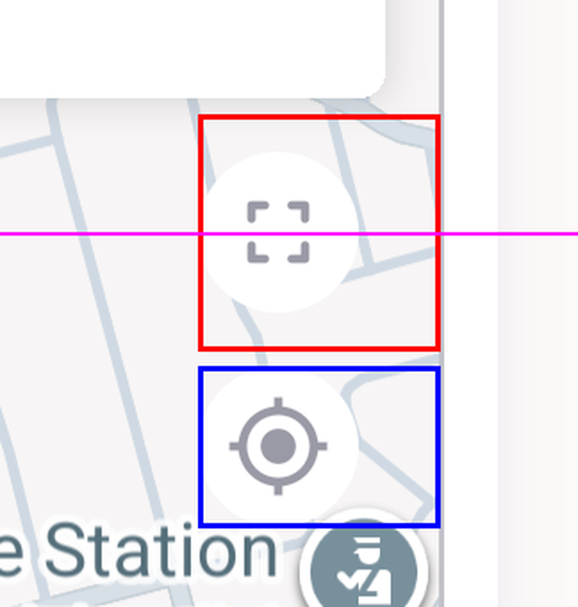
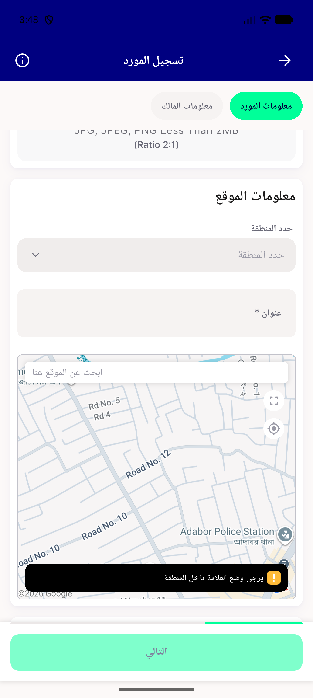
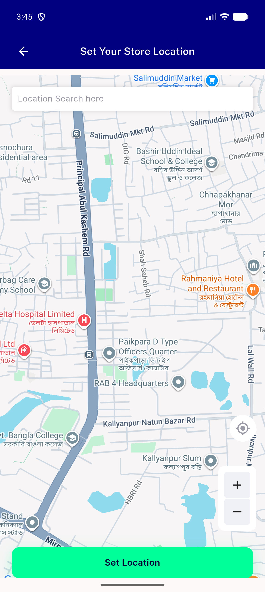

# QA Evidence — NEARS-1952

**PASS — expand control named + 45x44dp, navigation intact (emulator-5562, 480dpi)**

**5 screenshot(s).** Click any thumbnail for full resolution.

<table>
<tr>
<td align="center" width="33%"> ac1 ac3 node bounds annotated</td>
<td align="center" width="33%"> ac1 rtl arabic embedded map</td>
<td align="center" width="33%"> ac2a please select zone snackbar</td>
</tr>
<tr>
<td align="center" width="33%"> ac2b fullscreen map botedge tap</td>
<td align="center" width="33%"> ac2b fullscreen map topedge tap</td>
</tr>
</table>

### Other artifacts
- [`progress.md`](progress.md)

---
*From `nears/docs/qa-evidence/NEARS-1952/` · public-repo scrub policy (no live secrets; verified clean).*
