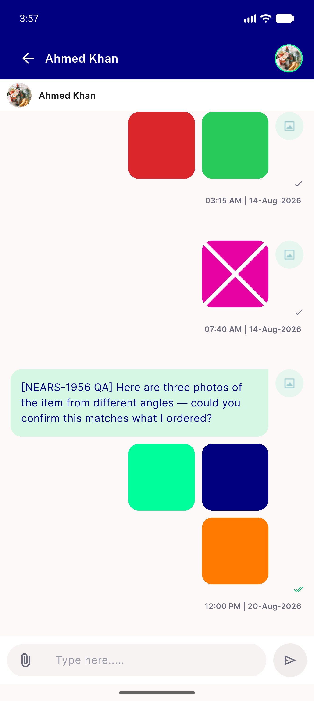

# QA Evidence — NEARS-1956

**PASS with 2 filed findings — AC1-4 demonstrated live, message-91 3-attachment paging + arrow states confirmed, message-75 single-attachment regression clean**

**12 screenshot(s).** Click any thumbnail for full resolution.

<table>
<tr>
<td align="center" width="33%"> ac2 after1tap</td>
<td align="center" width="33%"> ac2 back to page1</td>
<td align="center" width="33%"> ac2 back to page2</td>
</tr>
<tr>
<td align="center" width="33%"> ac2 check state</td>
<td align="center" width="33%"> ac2 grid thumbnails</td>
<td align="center" width="33%"> ac2 page clean open</td>
</tr>
<tr>
<td align="center" width="33%"> ac2 page1 navy v2</td>
<td align="center" width="33%"> ac2 page1 navy</td>
<td align="center" width="33%"> ac2 tap topright</td>
</tr>
<tr>
<td align="center" width="33%"> ac3 bottomtile open</td>
<td align="center" width="33%"> bug order swap topleft opens mint</td>
<td align="center" width="33%"> regression msg75 single lightbox</td>
</tr>
</table>

### Other artifacts
- [`bug-hero-tag-collision-on-shared-placeholder.log`](bug-hero-tag-collision-on-shared-placeholder.log)

---
*From `nears/docs/qa-evidence/NEARS-1956/` · public-repo scrub policy (no live secrets; verified clean).*
