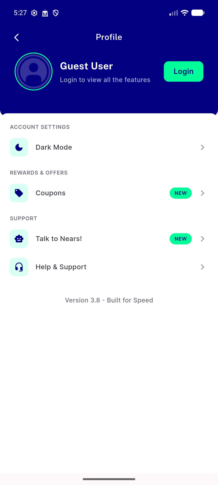

# QA Evidence — NEARS-1960

**PASS - language pill + guest button single-announce fix verified live, tap actions preserved**

**1 screenshot(s).** Click any thumbnail for full resolution.

<table>
<tr>
<td align="center" width="33%"> sign in screen fixed</td>
</tr>
</table>

### Other artifacts
- [`sign-in-a11y-dump1.xml`](sign-in-a11y-dump1.xml)
- [`sign-in-a11y-dump2.xml`](sign-in-a11y-dump2.xml)

---
*From `nears/docs/qa-evidence/NEARS-1960/` · public-repo scrub policy (no live secrets; verified clean).*
