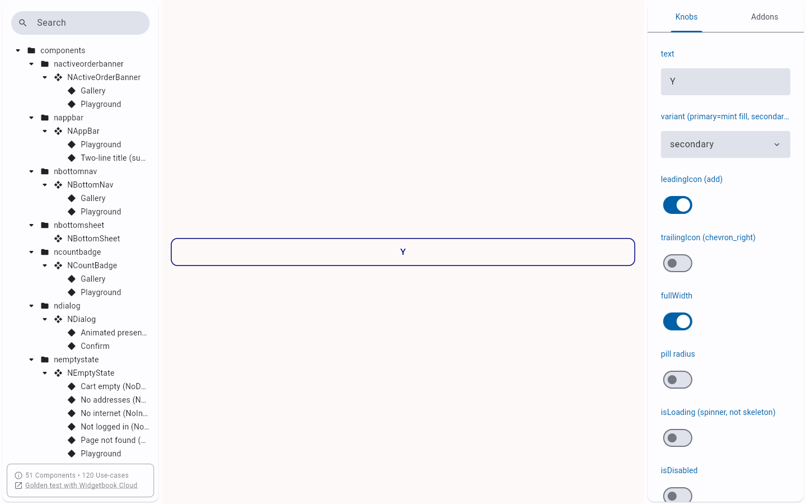
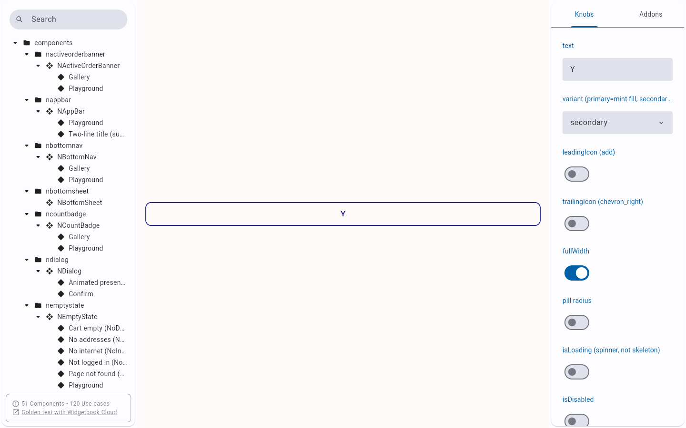
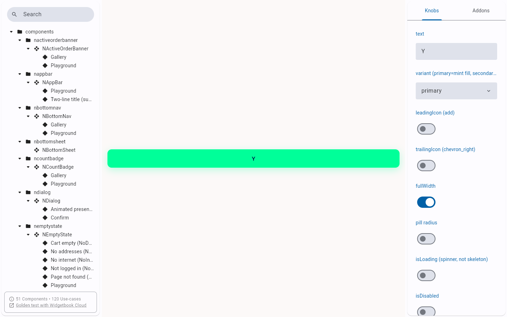
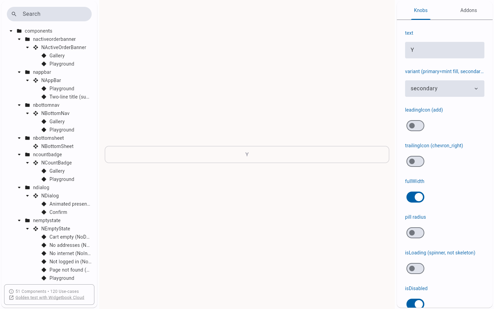

# QA Evidence — NEARS-1961

**PASS — secondary NButton.semanticLabel honoured live (widgetbook + a11y tree), no regression**

**4 screenshot(s).** Click any thumbnail for full resolution.

<table>
<tr>
<td align="center" width="33%"> ac1 secondary icon semanticlabel</td>
<td align="center" width="33%"> ac1 secondary semanticlabel</td>
<td align="center" width="33%"> ac3 primary baseline</td>
</tr>
<tr>
<td align="center" width="33%"> ac3 secondary disabled</td>
</tr>
</table>

### Other artifacts
- [`ac1-secondary-icon-semanticlabel.aria.txt`](ac1-secondary-icon-semanticlabel.aria.txt)
- [`ac1-secondary-semanticlabel.aria.txt`](ac1-secondary-semanticlabel.aria.txt)

---
*From `nears/docs/qa-evidence/NEARS-1961/` · public-repo scrub policy (no live secrets; verified clean).*
