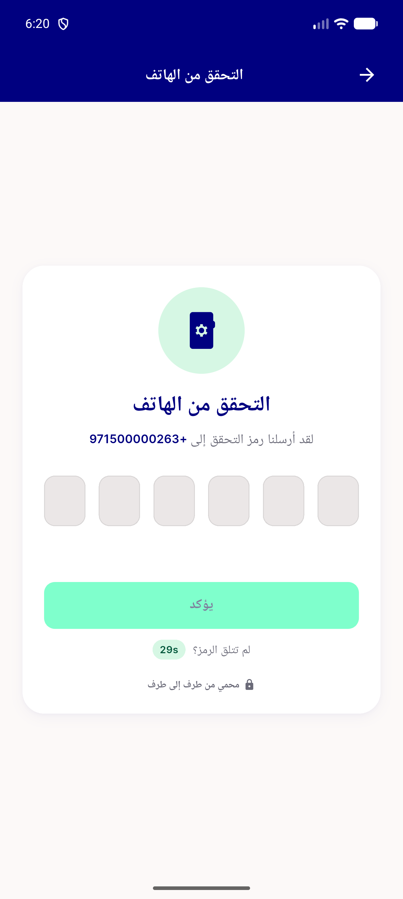

# QA Evidence — NEARS-1963

**FAIL — AC1/AC2 PASS (accessible name + real bounds confirmed) but tap-to-focus on the OTP PinCodeTextField is broken (mInputShown stays false, digits never register, Flutter's own FocusManager confirms focus never reaches the field) — blocks normal OTP entry and cascades to block AC3/error-shake live demonstration; double-dispose fix itself is clean (no crash on enter+immediately-back-out).**

**1 screenshot(s).** Click any thumbnail for full resolution.

<table>
<tr>
<td align="center" width="33%"> otp field no focus rtl arabic</td>
</tr>
</table>

### Other artifacts
- [`ac1-ac2-verification-field-dump1.xml`](ac1-ac2-verification-field-dump1.xml)
- [`ac1-ac2-verification-field-dump2.xml`](ac1-ac2-verification-field-dump2.xml)
- [`bug-otp-focusmanager-dump.txt`](bug-otp-focusmanager-dump.txt)
- [`bug-otp-tap-no-focus-fresh-process.xml`](bug-otp-tap-no-focus-fresh-process.xml)
- [`bug-otp-tap-no-focus-talkback-off.xml`](bug-otp-tap-no-focus-talkback-off.xml)
- [`bug-otp-tap-no-focus-talkback-on.xml`](bug-otp-tap-no-focus-talkback-on.xml)
- [`bug-otp-tap-no-focus.log`](bug-otp-tap-no-focus.log)
- [`control-phone-field-focuses-normally.xml`](control-phone-field-focuses-normally.xml)

---
*From `nears/docs/qa-evidence/NEARS-1963/` · public-repo scrub policy (no live secrets; verified clean).*
