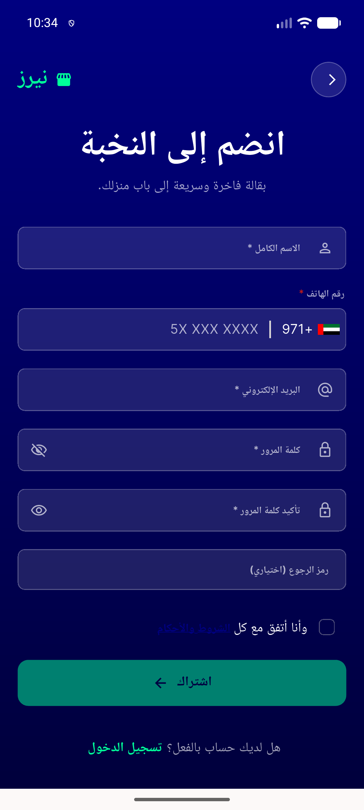
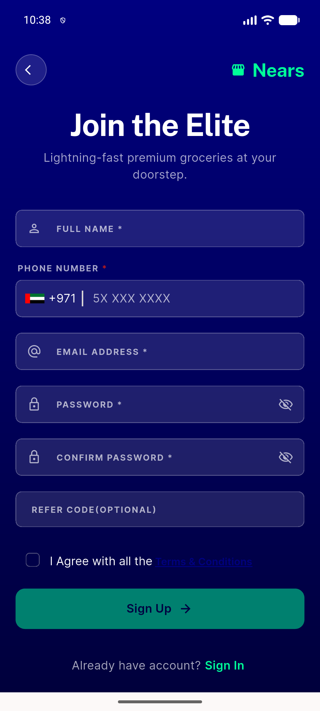

# QA Evidence — NEARS-1964

**PASS — confirm-password toggle a11y name distinct from password toggle**

**2 screenshot(s).** Click any thumbnail for full resolution.

<table>
<tr>
<td align="center" width="33%"> ac1 ac2 ar signup distinct names</td>
<td align="center" width="33%"> ac1 ac2 en signup distinct names</td>
</tr>
</table>

### Other artifacts
- [`ac1-ac2-ar-signup-pretap-dump.xml`](ac1-ac2-ar-signup-pretap-dump.xml)
- [`ac1-ac2-en-both-reverted-dump.xml`](ac1-ac2-en-both-reverted-dump.xml)
- [`ac1-ac2-en-signup-pretap-dump.xml`](ac1-ac2-en-signup-pretap-dump.xml)
- [`ac1-ac3-en-password-toggle-flipped-dump.xml`](ac1-ac3-en-password-toggle-flipped-dump.xml)
- [`ac2-ac3-ar-confirm-toggle-flipped-dump.xml`](ac2-ac3-ar-confirm-toggle-flipped-dump.xml)
- [`ac2-ac3-en-confirm-toggle-flipped-dump.xml`](ac2-ac3-en-confirm-toggle-flipped-dump.xml)

---
*From `nears/docs/qa-evidence/NEARS-1964/` · public-repo scrub policy (no live secrets; verified clean).*
