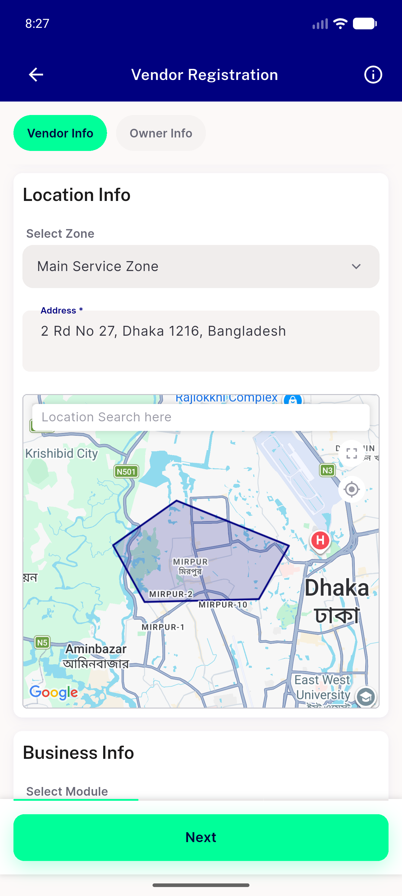
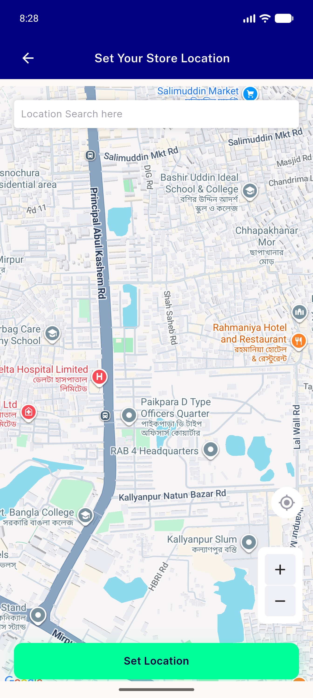
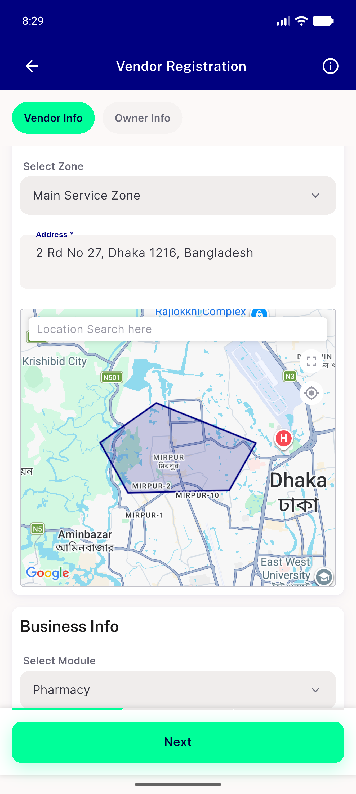
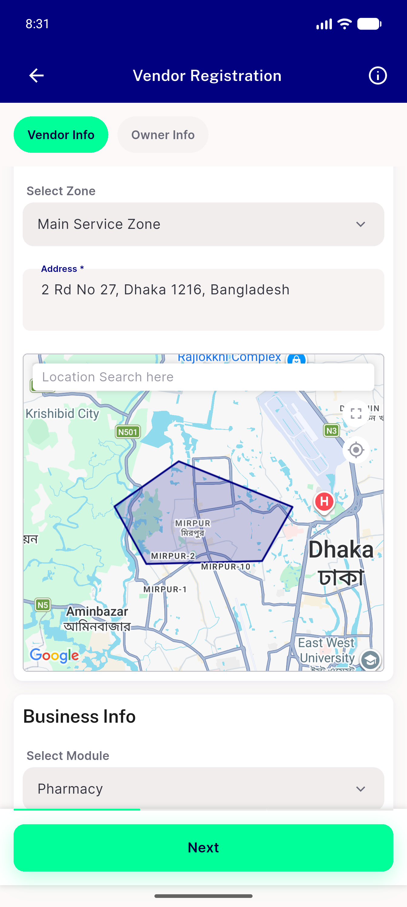
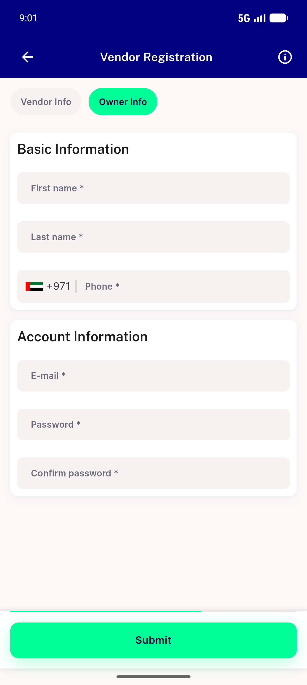
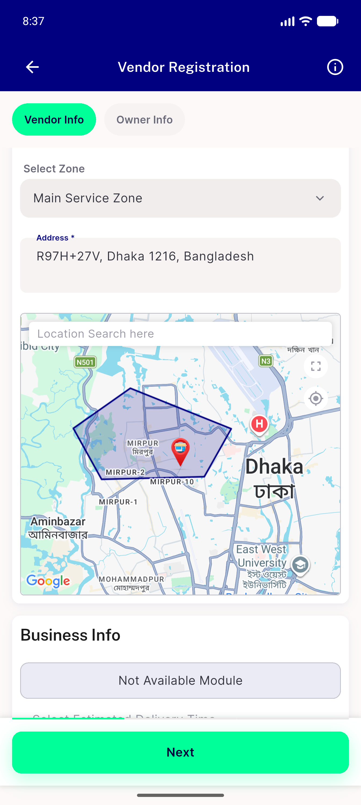
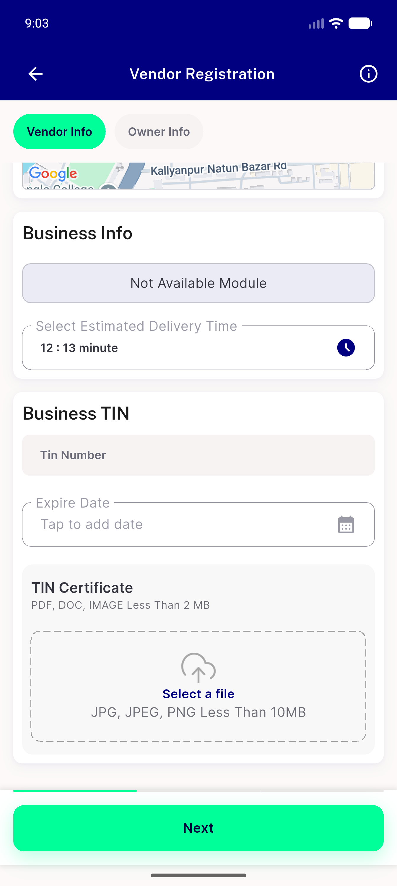
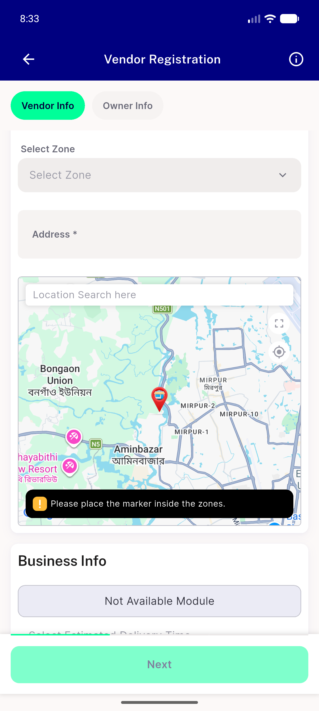
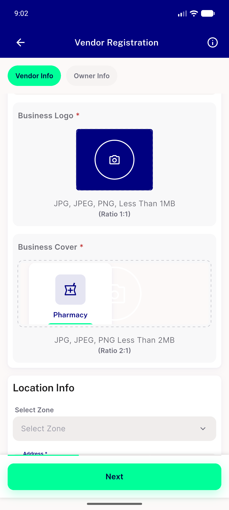
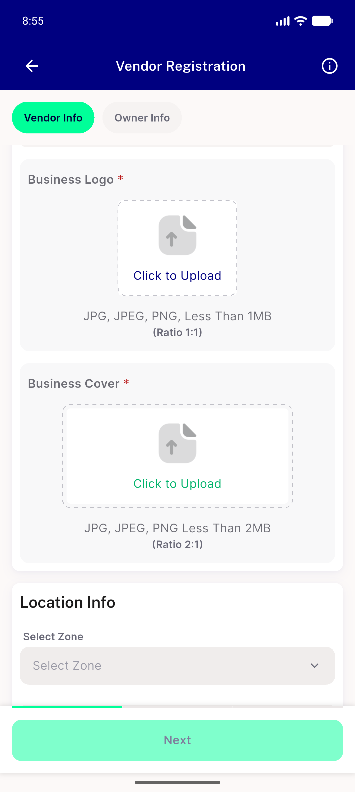

# QA Evidence — NEARS-1967

**PASS — NEARS-1967 zone/module survive the fullscreen-map round trip (AC1-AC3, R1-R3 all PASS; broader 'any tap' claim refuted)**

**10 screenshot(s).** Click any thumbnail for full resolution.

<table>
<tr>
<td align="center" width="33%"> ac1 01 before expand</td>
<td align="center" width="33%"> ac1 02 fullscreen map open</td>
<td align="center" width="33%"> ac1 03 after back zone and module intact</td>
</tr>
<tr>
<td align="center" width="33%"> ac2 cycle3 zone and module intact</td>
<td align="center" width="33%"> ac3 advanced to owner info</td>
<td align="center" width="33%"> bt a inside zone tap preserves zone</td>
</tr>
<tr>
<td align="center" width="33%"> bt b fullscreen map in zone cta</td>
<td align="center" width="33%"> bt b outside zone tap clears zone</td>
<td align="center" width="33%"> bug stepback resets zone and module</td>
</tr>
<tr>
<td align="center" width="33%"> r2 cold enter shows select zone</td>
</tr>
</table>

### Other artifacts
- [`bt-b-fullscreen-not-in-zone-cta.log`](bt-b-fullscreen-not-in-zone-cta.log)
- [`bug-storereg-out-of-zone-getzoneid-anr.log`](bug-storereg-out-of-zone-getzoneid-anr.log)

---
*From `nears/docs/qa-evidence/NEARS-1967/` · public-repo scrub policy (no live secrets; verified clean).*
