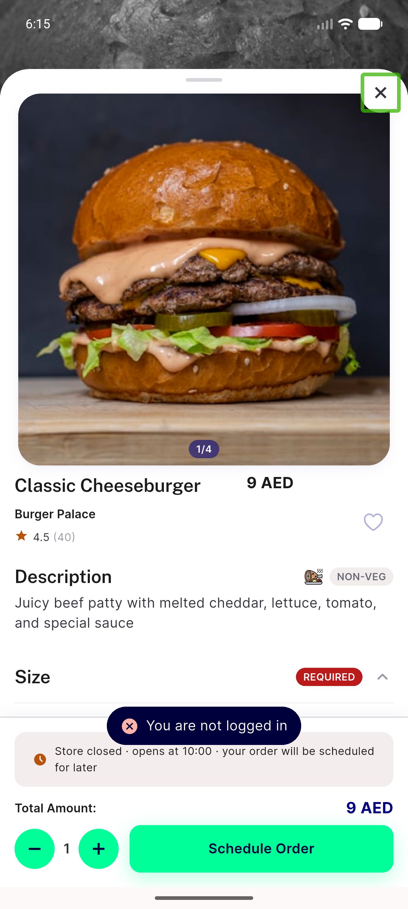
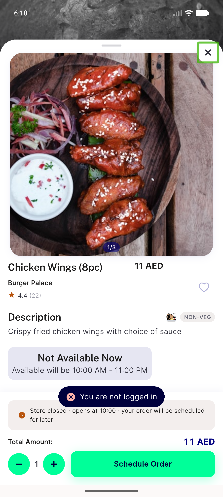
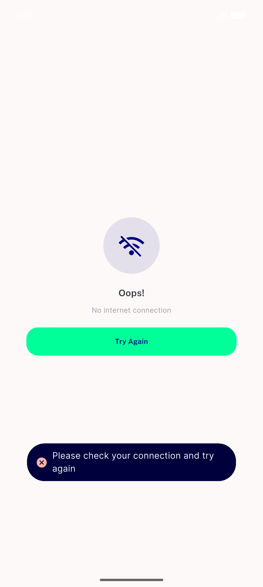

# QA Evidence — NEARS-1968

**PASS — GetX toast now announces under TalkBack (0->1 utterance); ticket premise falsified: text was already in the a11y tree on both paths**

**4 screenshot(s).** Click any thumbnail for full resolution.

<table>
<tr>
<td align="center" width="33%"> ac1 getx toast BASE</td>
<td align="center" width="33%"> ac1 getx toast fix ar</td>
<td align="center" width="33%"> ac1 getx toast fix</td>
</tr>
<tr>
<td align="center" width="33%"> regression no internet getx toast</td>
</tr>
</table>

### Other artifacts
- [`measurements.log`](measurements.log)
- [`progress.md`](progress.md)

---
*From `nears/docs/qa-evidence/NEARS-1968/` · public-repo scrub policy (no live secrets; verified clean).*
