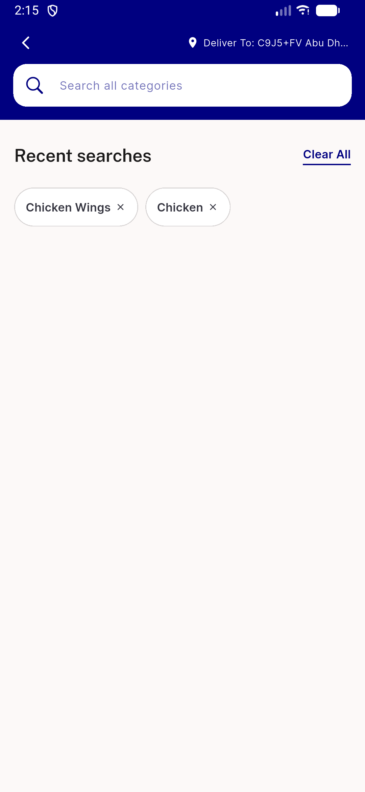
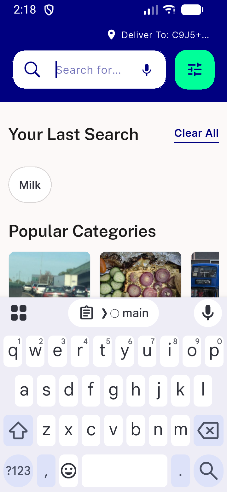

# QA Evidence — NEARS-1970

**PASS — 3 IntrinsicWidth guards removed (search_screen.dart x1, global_search_screen.dart x2), chips confirmed pixel-identical content-sizing pre/post-removal at normal+narrow widths, live on emulator-5566**

**3 screenshot(s).** Click any thumbnail for full resolution.

<table>
<tr>
<td align="center" width="33%"> global search history chips normal</td>
<td align="center" width="33%"> search screen lastsearch chip narrow</td>
<td align="center" width="33%"> search screen lastsearch chip normal</td>
</tr>
</table>

---
*From `nears/docs/qa-evidence/NEARS-1970/` · public-repo scrub policy (no live secrets; verified clean).*
