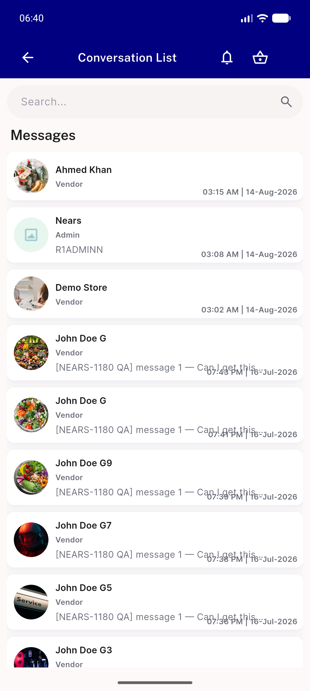
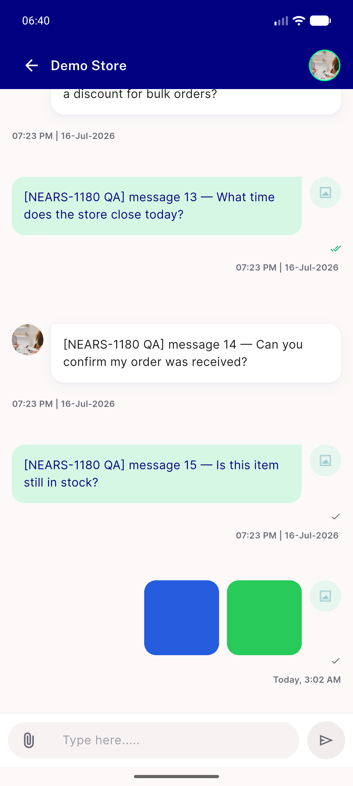
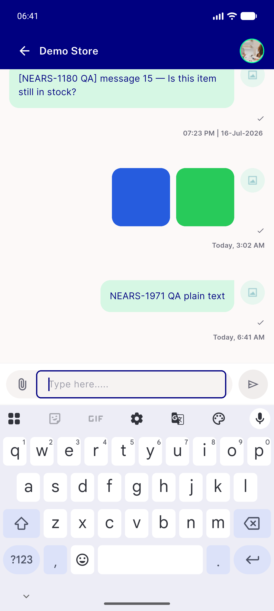
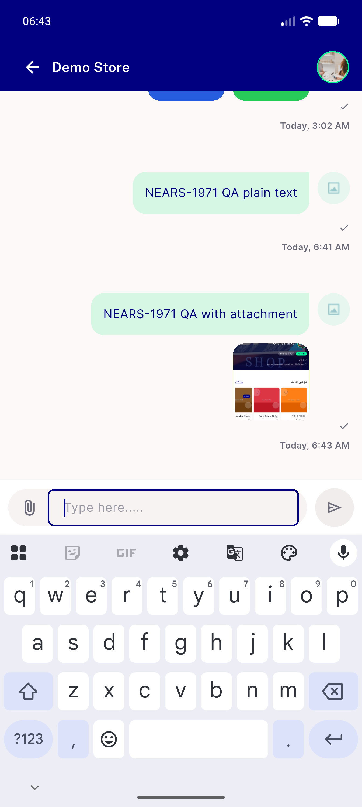
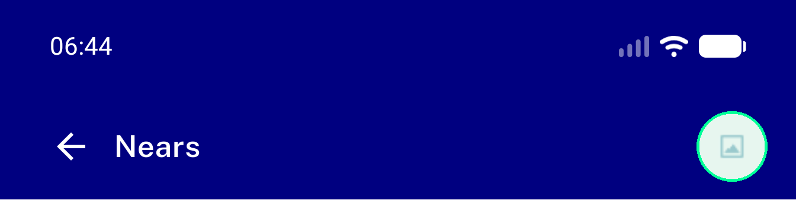
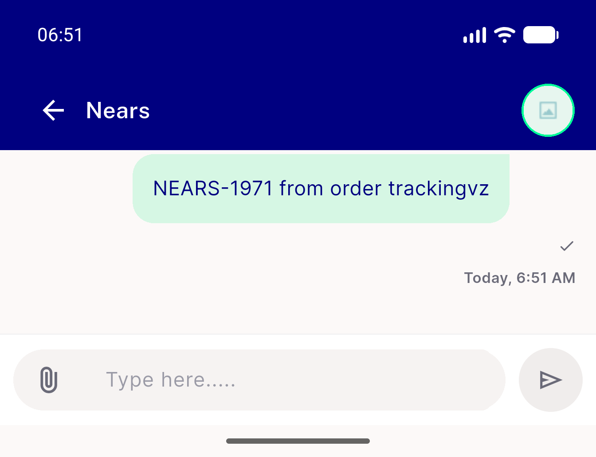
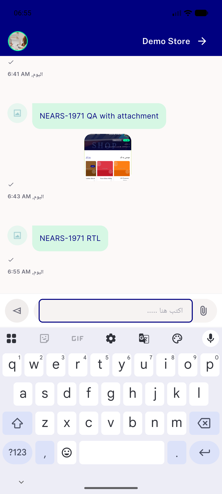
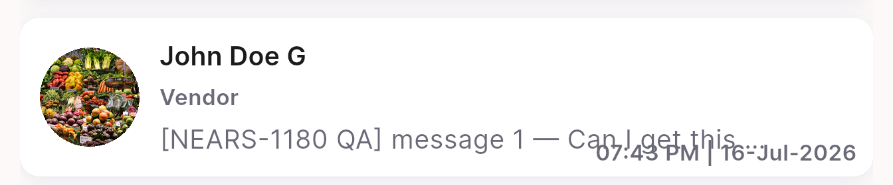

# QA Evidence — NEARS-1971

**PASS — 7/7 ACs verified by unit/widget test (null degrade not live-reachable by design); live regression sweep clean on emulator-5558**

**8 screenshot(s).** Click any thumbnail for full resolution.

<table>
<tr>
<td align="center" width="33%"> conversation list</td>
<td align="center" width="33%"> thread demo store from list</td>
<td align="center" width="33%"> text message sent</td>
</tr>
<tr>
<td align="center" width="33%"> attachment message sent</td>
<td align="center" width="33%"> admin thread header</td>
<td align="center" width="33%"> order tracking entry admin arm</td>
</tr>
<tr>
<td align="center" width="33%"> rtl arabic thread</td>
<td align="center" width="33%"> bug convlist preview timestamp overlap</td>
</tr>
</table>

---
*From `nears/docs/qa-evidence/NEARS-1971/` · public-repo scrub policy (no live secrets; verified clean).*
