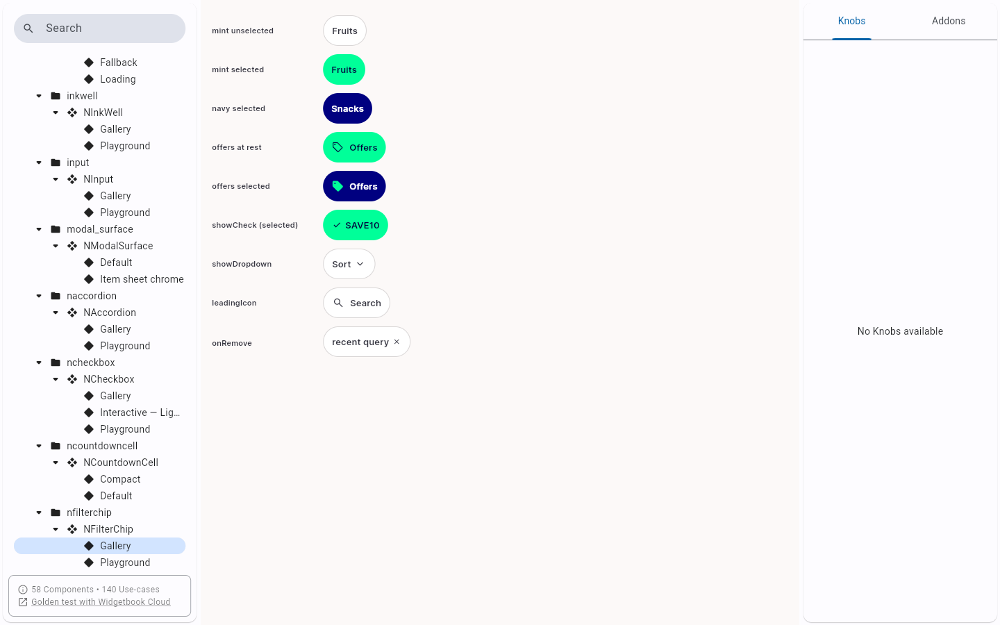
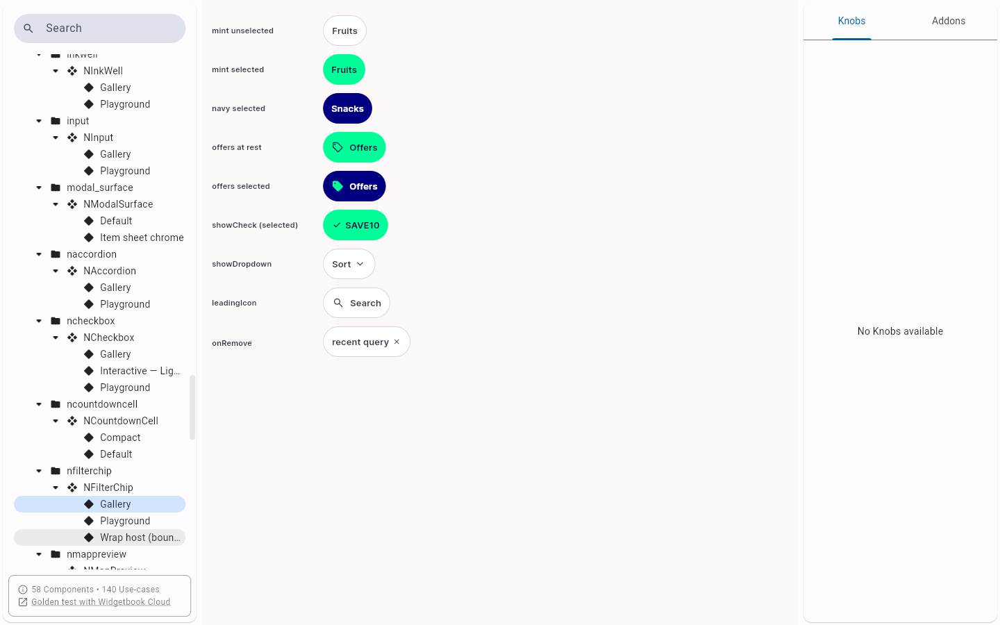
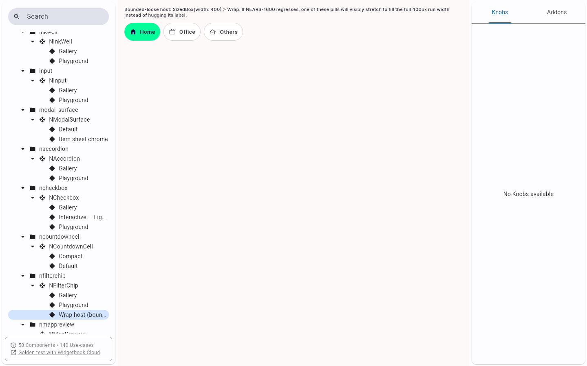

# QA Evidence — NEARS-1973

**PASS - Wrap-host NFilterChip regression net verified live + automated test toggle-confirmed**

**4 screenshot(s).** Click any thumbnail for full resolution.

<table>
<tr>
<td align="center" width="33%"> widgetbook home</td>
<td align="center" width="33%"> nfilterchip gallery regression</td>
<td align="center" width="33%"> tree wraphost visible</td>
</tr>
<tr>
<td align="center" width="33%"> wraphost story ac1</td>
</tr>
</table>

---
*From `nears/docs/qa-evidence/NEARS-1973/` · public-repo scrub policy (no live secrets; verified clean).*
