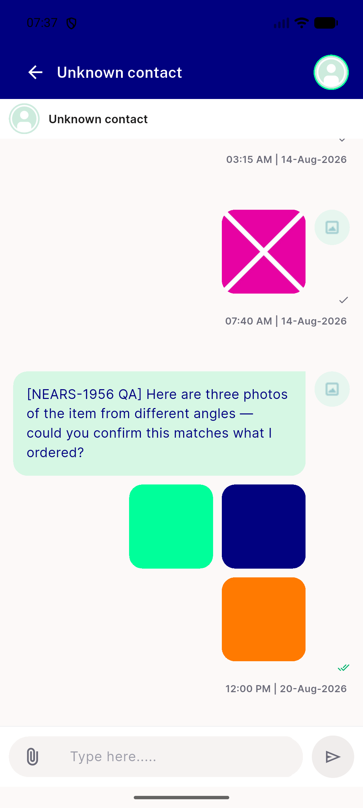
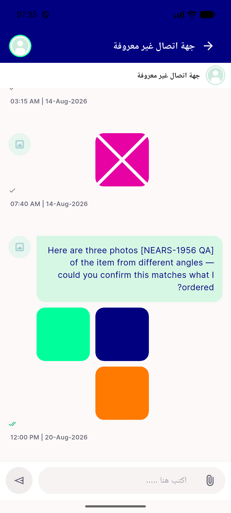

# QA Evidence — NEARS-1974

**PASS — chat appbar/body-header unknown_contact fallback demonstrated live, English+Arabic, no regressions**

**2 screenshot(s).** Click any thumbnail for full resolution.

<table>
<tr>
<td align="center" width="33%"> ac1 unknown contact english</td>
<td align="center" width="33%"> ac3 unknown contact arabic</td>
</tr>
</table>

---
*From `nears/docs/qa-evidence/NEARS-1974/` · public-repo scrub policy (no live secrets; verified clean).*
