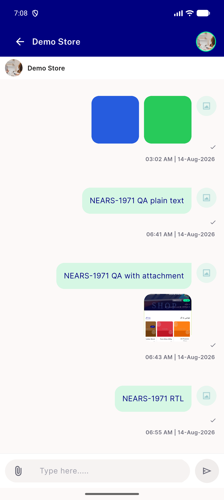
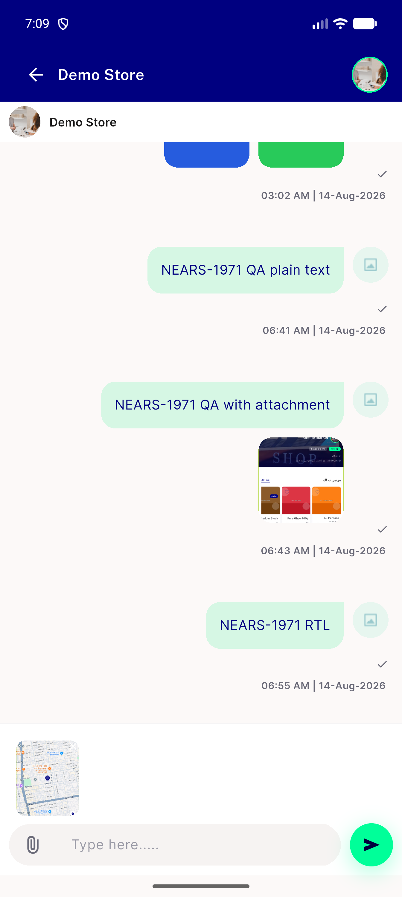
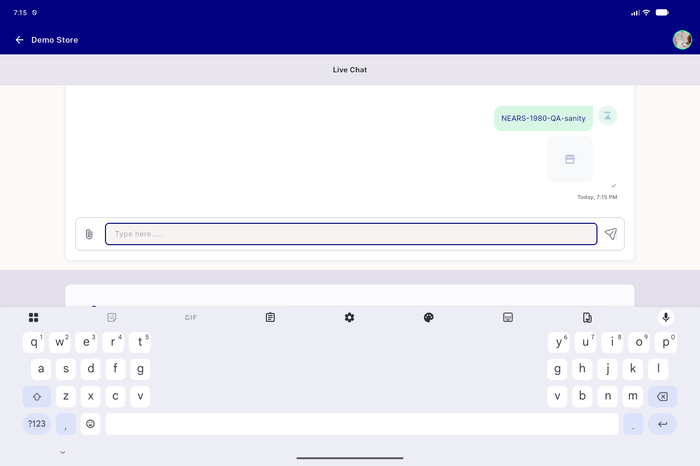
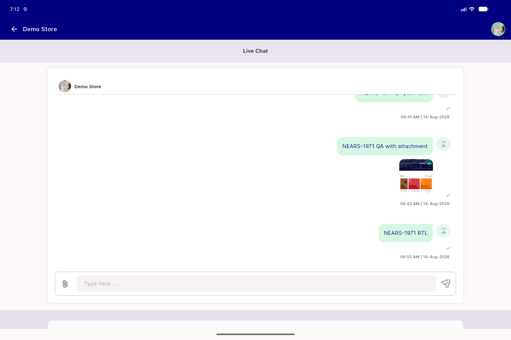
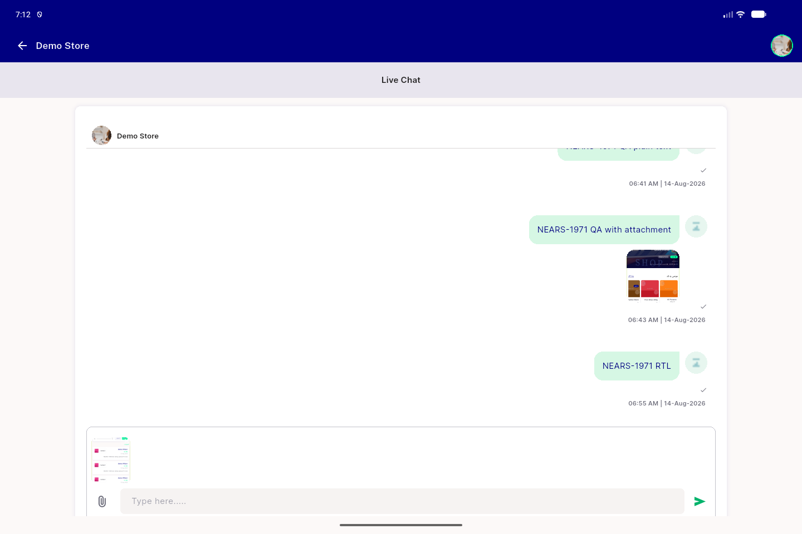

# QA Evidence — NEARS-1980

**PASS — chat_screen.dart shared-widget extraction verified live, both desktop & mobile arms, zero visual/behavior change**

**6 screenshot(s).** Click any thumbnail for full resolution.

<table>
<tr>
<td align="center" width="33%"> ac1 mobile after remove badge tap</td>
<td align="center" width="33%"> ac1 mobile header thread compose</td>
<td align="center" width="33%"> ac1 mobile staged image carousel</td>
</tr>
<tr>
<td align="center" width="33%"> ac2 desktop after send</td>
<td align="center" width="33%"> ac2 desktop header thread compose</td>
<td align="center" width="33%"> ac2 desktop staged image carousel</td>
</tr>
</table>

---
*From `nears/docs/qa-evidence/NEARS-1980/` · public-repo scrub policy (no live secrets; verified clean).*
