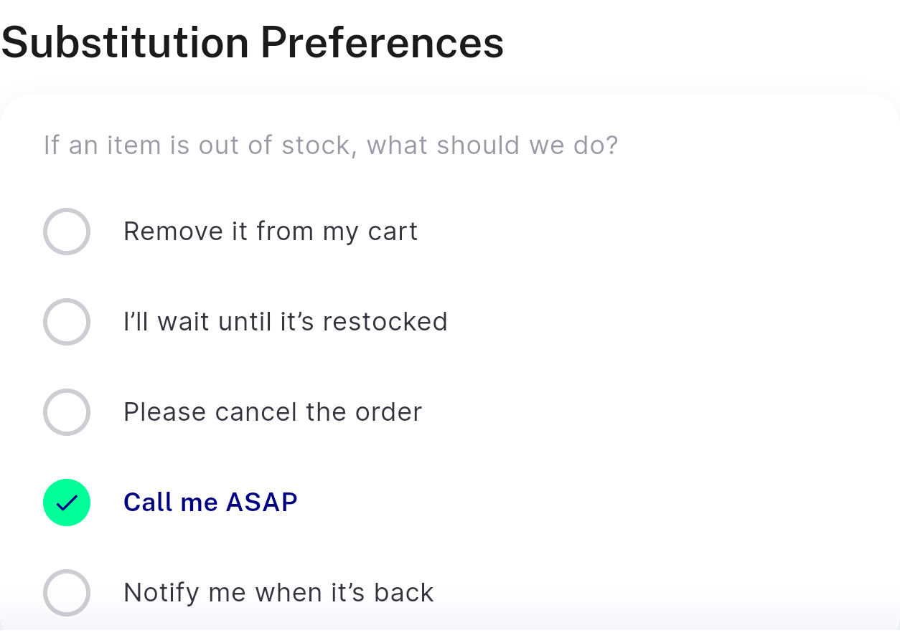
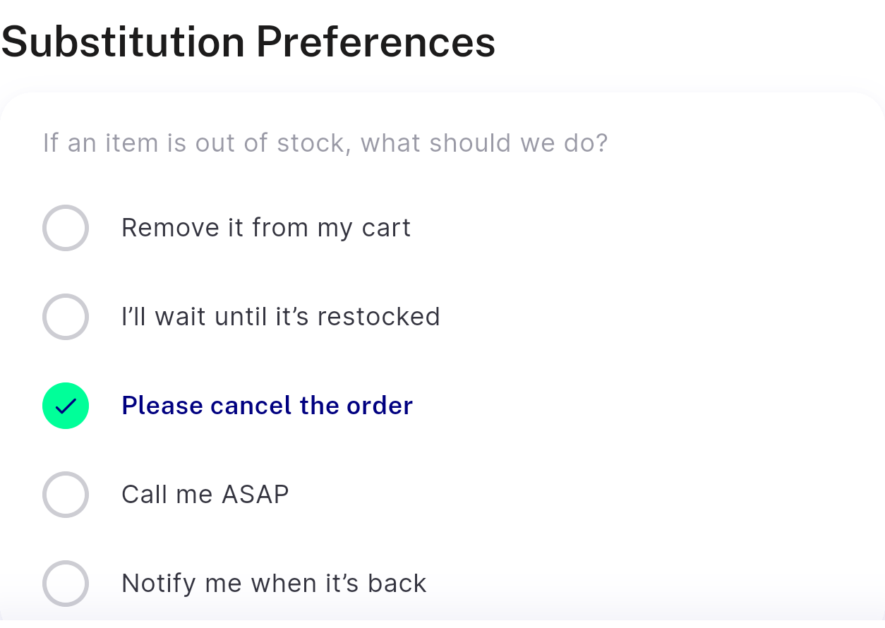

# QA Evidence — NEARS-1982

**PASS — NEARS-1982 dead SubstitutionPreferenceSelector delete; AC3 verified live on emulator-5558, cart substitution block unchanged (5 radio rows, selection round-trip), suites +3757~2-4 identical base vs HEAD**

**2 screenshot(s).** Click any thumbnail for full resolution.

<table>
<tr>
<td align="center" width="33%"> ac3 cart substitution default</td>
<td align="center" width="33%"> ac3 cart substitution nondefault selected</td>
</tr>
</table>

### Other artifacts
- [`progress.md`](progress.md)

---
*From `nears/docs/qa-evidence/NEARS-1982/` · public-repo scrub policy (no live secrets; verified clean).*
