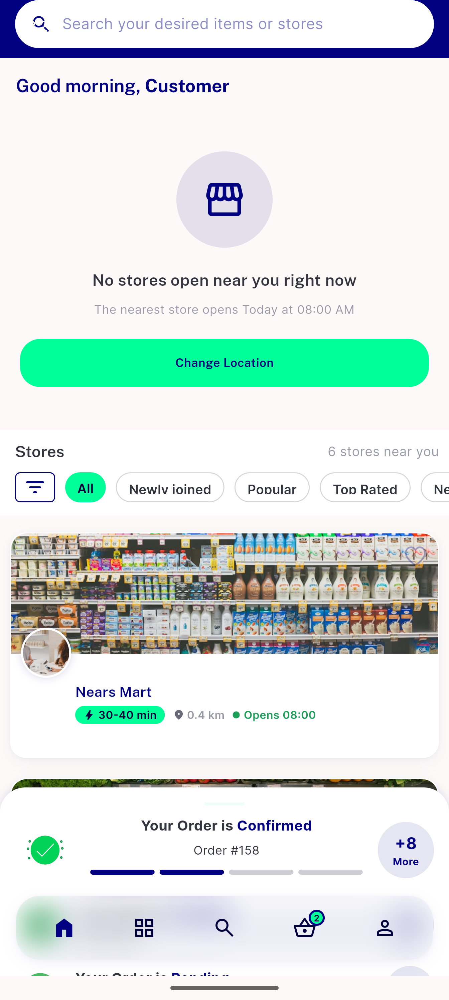

# QA Evidence — NEARS-1983

**FIX VERIFIED - Grocery new copy renders, old string absent; Food/Pharmacy unchanged; Arabic RTL correct**

**5 screenshot(s).** Click any thumbnail for full resolution.

<table>
<tr>
<td align="center" width="33%"> fix food unchanged</td>
<td align="center" width="33%"> fix grocery arabic rtl</td>
<td align="center" width="33%"> fix grocery new copy</td>
</tr>
<tr>
<td align="center" width="33%"> food empty state over populated list</td>
<td align="center" width="33%"> grocery empty state over populated list</td>
</tr>
</table>

### Other artifacts
- [`bug-map-screen-latlngbounds-assert.log`](bug-map-screen-latlngbounds-assert.log)
- [`fix-food-a11y-dump.txt`](fix-food-a11y-dump.txt)
- [`fix-grocery-a11y-dump.txt`](fix-grocery-a11y-dump.txt)
- [`fix-grocery-arabic-a11y-dump.txt`](fix-grocery-arabic-a11y-dump.txt)
- [`fix-pharmacy-no-empty-state.txt`](fix-pharmacy-no-empty-state.txt)
- [`fix-positive-control-open-hour.txt`](fix-positive-control-open-hour.txt)
- [`food-a11y-dump-copresent.txt`](food-a11y-dump-copresent.txt)
- [`grocery-a11y-dump-copresent.txt`](grocery-a11y-dump-copresent.txt)
- [`positive-control-open-hour.txt`](positive-control-open-hour.txt)

---
*From `nears/docs/qa-evidence/NEARS-1983/` · public-repo scrub policy (no live secrets; verified clean).*
