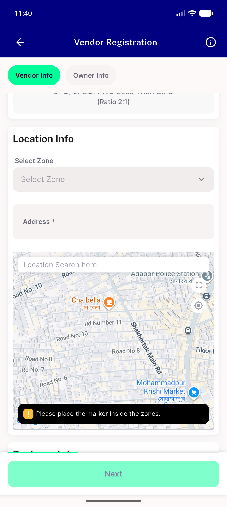
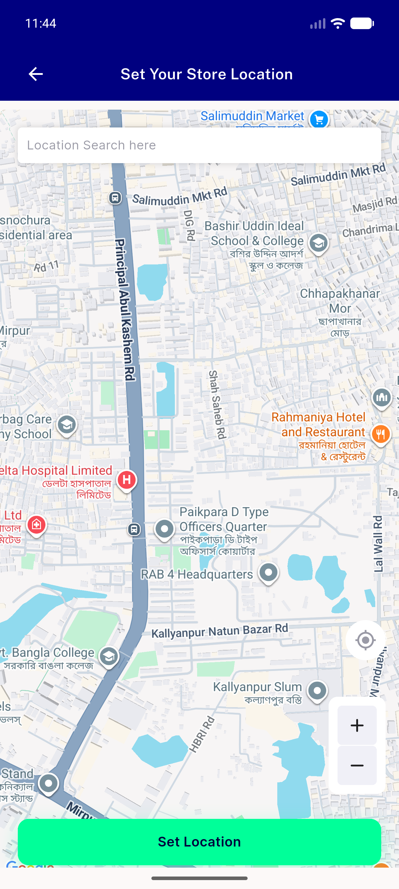
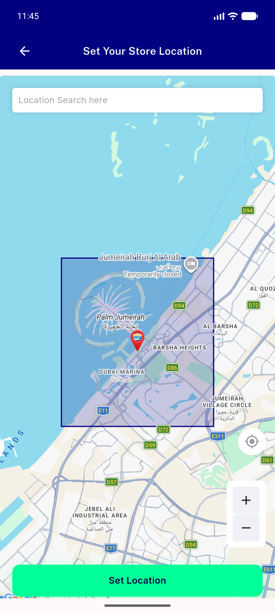

# QA Evidence — NEARS-1984

**PASS — NEARS-1984 current-location tap target 45x30dp -> 45x44dp, all 8 boundary taps two-sided, no collision with the NEARS-1952 expand box (emulator-5558, density 480/dpr 3.0)**

**3 screenshot(s).** Click any thumbnail for full resolution.

<table>
<tr>
<td align="center" width="33%"> inline map controls</td>
<td align="center" width="33%"> ac2 expand opens fullscreen</td>
<td align="center" width="33%"> fullscreen arm 60x45 works</td>
</tr>
</table>

### Other artifacts
- [`progress.md`](progress.md)

---
*From `nears/docs/qa-evidence/NEARS-1984/` · public-repo scrub policy (no live secrets; verified clean).*
