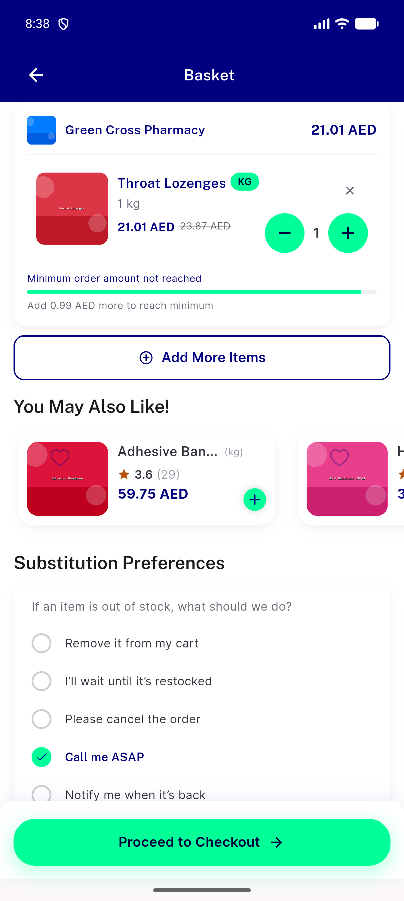
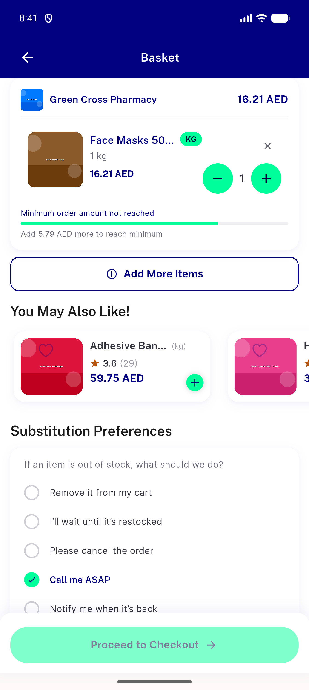
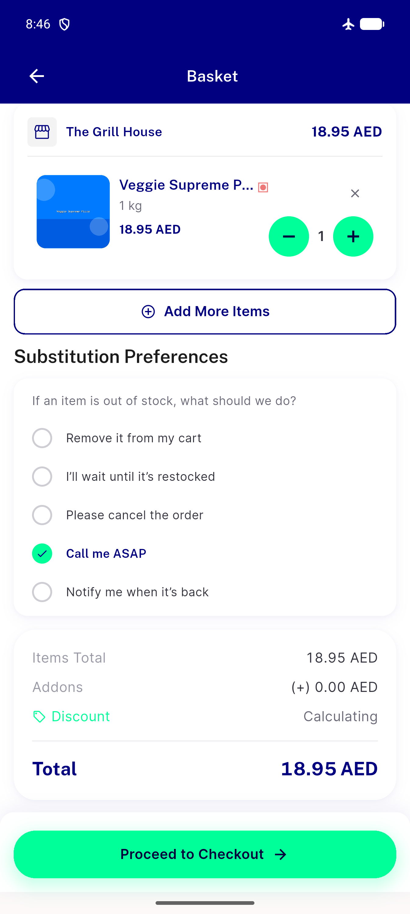
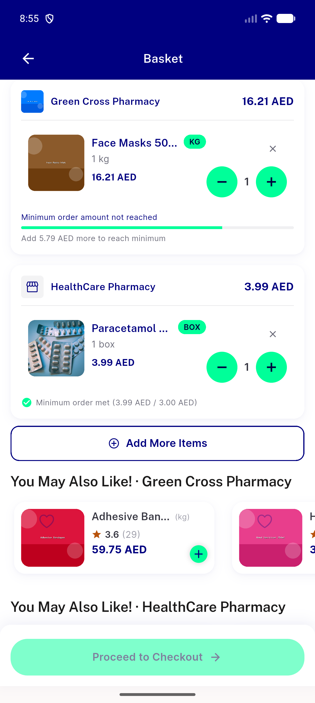

# QA Evidence — NEARS-1988

**PASS - cart minimum-order gate compares gross enforced total (AC1-AC4 demonstrated live, emulator-5554)**

**4 screenshot(s).** Click any thumbnail for full resolution.

<table>
<tr>
<td align="center" width="33%"> ac1 proceed enabled below subtotal</td>
<td align="center" width="33%"> ac3 proceed disabled negative control</td>
<td align="center" width="33%"> ac4 proceed enabled unresolved minimum network off</td>
</tr>
<tr>
<td align="center" width="33%"> multistore per section gate</td>
</tr>
</table>

---
*From `nears/docs/qa-evidence/NEARS-1988/` · public-repo scrub policy (no live secrets; verified clean).*
