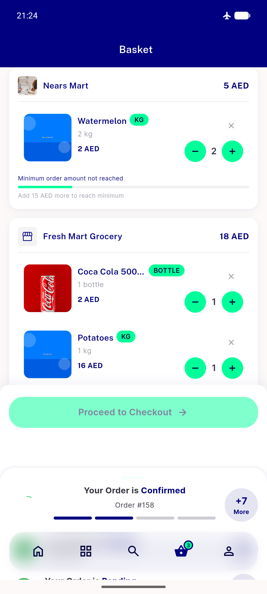

# QA Evidence — NEARS-1991

**AC2 PASS — transient network failure: cart row survives at qty 2, siblings undisturbed**

**1 screenshot(s).** Click any thumbnail for full resolution.

<table>
<tr>
<td align="center" width="33%"> ac2 after transient failure row survives</td>
</tr>
</table>

---
*From `nears/docs/qa-evidence/NEARS-1991/` · public-repo scrub policy (no live secrets; verified clean).*
