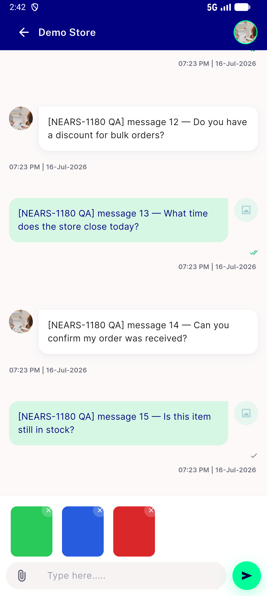
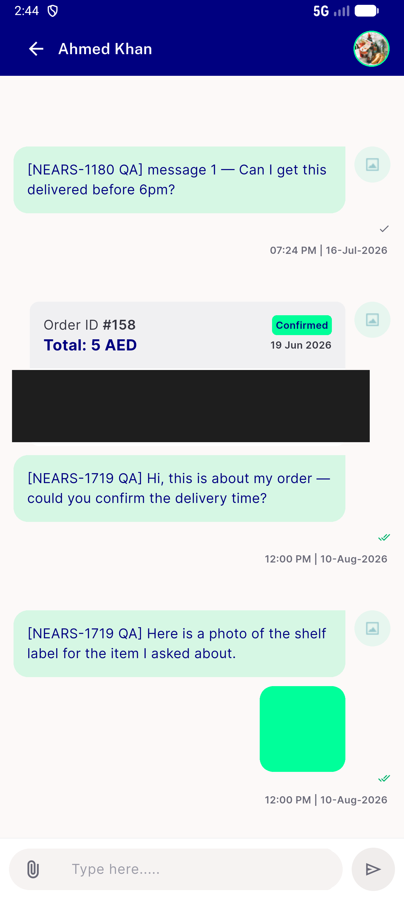
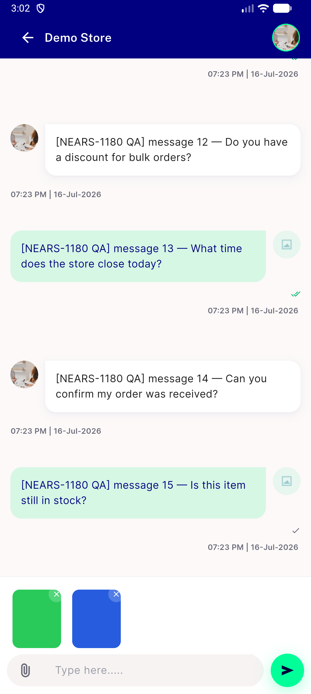
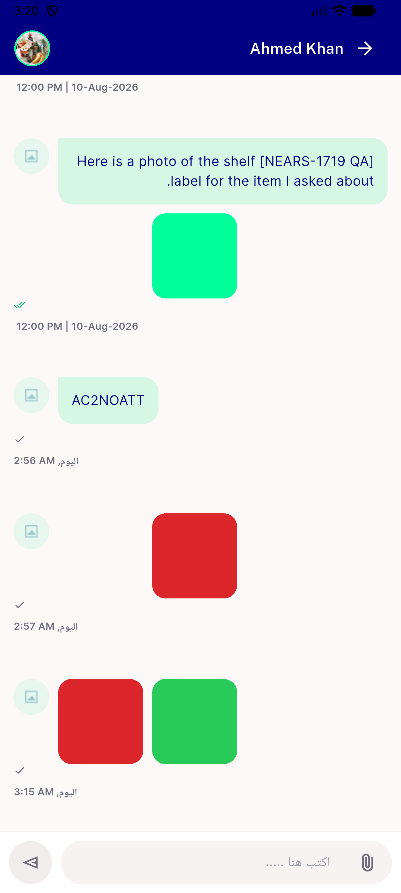

# QA Evidence — NEARS-1999

**PASS — cross-recipient attachment leak closed: AC1/AC2/AC7/R1 all demonstrated live on emulator-5564, receiving side verified by read-only SELECT (msg 76 file=NULL cross-thread, 77/78/80 file populated same-thread)**

**4 screenshot(s).** Click any thumbnail for full resolution.

<table>
<tr>
<td align="center" width="33%"> ac1 01 threadA 3 staged</td>
<td align="center" width="33%"> ac1 02 threadB empty strip</td>
<td align="center" width="33%"> ac7 01 retry preserved 2 staged</td>
</tr>
<tr>
<td align="center" width="33%"> rtl 01 arabic empty strip after switch</td>
</tr>
</table>

---
*From `nears/docs/qa-evidence/NEARS-1999/` · public-repo scrub policy (no live secrets; verified clean).*
